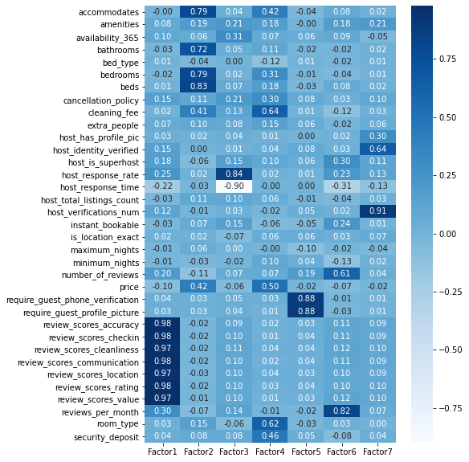

```python
import requests
import pandas as pd
import numpy as np
import seaborn as sns
from sklearn.preprocessing import StandardScaler
from sklearn.decomposition import PCA
import matplotlib.pyplot as plt
%matplotlib inline
from factor_analyzer import FactorAnalyzer

```


```python
# https://public.opendatasoft.com/api/records/1.0/search/?dataset=airbnb-listings&q=where+country_code+%3D+'US'+and+city+%3D+%22New+York%22&rows=10
r = requests.get("https://public.opendatasoft.com/api/records/1.0/search/?dataset=airbnb-listings&q=where+country_code+%3D+'US'&rows=10000")#+and+city+%3D+%22New+York%22
records = r.json()['records']
```


```python
df_records = []
for r in records:
  df_records.append(r['fields'])
```


```python
df = pd.DataFrame(df_records)


df = df.sort_index(axis=1)
```


```python
df.info()
```

    <class 'pandas.core.frame.DataFrame'>
    RangeIndex: 10000 entries, 0 to 9999
    Data columns (total 89 columns):
     #   Column                          Non-Null Count  Dtype  
    ---  ------                          --------------  -----  
     0   access                          7624 non-null   object 
     1   accommodates                    9995 non-null   float64
     2   amenities                       9955 non-null   object 
     3   availability_30                 10000 non-null  int64  
     4   availability_365                10000 non-null  int64  
     5   availability_60                 10000 non-null  int64  
     6   availability_90                 10000 non-null  int64  
     7   bathrooms                       9978 non-null   float64
     8   bed_type                        10000 non-null  object 
     9   bedrooms                        9998 non-null   float64
     10  beds                            9994 non-null   float64
     11  calculated_host_listings_count  10000 non-null  int64  
     12  calendar_last_scraped           10000 non-null  object 
     13  calendar_updated                10000 non-null  object 
     14  cancellation_policy             10000 non-null  object 
     15  city                            9999 non-null   object 
     16  cleaning_fee                    7705 non-null   float64
     17  country                         10000 non-null  object 
     18  country_code                    10000 non-null  object 
     19  description                     10000 non-null  object 
     20  experiences_offered             10000 non-null  object 
     21  extra_people                    10000 non-null  int64  
     22  features                        9995 non-null   object 
     23  first_review                    8335 non-null   object 
     24  geolocation                     10000 non-null  object 
     25  guests_included                 10000 non-null  int64  
     26  has_availability                265 non-null    object 
     27  host_about                      7483 non-null   object 
     28  host_acceptance_rate            1372 non-null   object 
     29  host_id                         10000 non-null  object 
     30  host_listings_count             9974 non-null   float64
     31  host_location                   9951 non-null   object 
     32  host_name                       9974 non-null   object 
     33  host_neighbourhood              8477 non-null   object 
     34  host_picture_url                9974 non-null   object 
     35  host_response_rate              8192 non-null   float64
     36  host_response_time              8192 non-null   object 
     37  host_since                      9974 non-null   object 
     38  host_thumbnail_url              9974 non-null   object 
     39  host_total_listings_count       9974 non-null   float64
     40  host_url                        10000 non-null  object 
     41  host_verifications              9999 non-null   object 
     42  house_rules                     7758 non-null   object 
     43  id                              10000 non-null  object 
     44  interaction                     7542 non-null   object 
     45  jurisdiction_names              5052 non-null   object 
     46  last_review                     8348 non-null   object 
     47  last_scraped                    10000 non-null  object 
     48  latitude                        10000 non-null  object 
     49  license                         957 non-null    object 
     50  listing_url                     10000 non-null  object 
     51  longitude                       10000 non-null  object 
     52  market                          9934 non-null   object 
     53  maximum_nights                  10000 non-null  int64  
     54  medium_url                      8409 non-null   object 
     55  minimum_nights                  10000 non-null  int64  
     56  monthly_price                   2273 non-null   float64
     57  name                            10000 non-null  object 
     58  neighborhood_overview           8122 non-null   object 
     59  neighbourhood                   8135 non-null   object 
     60  neighbourhood_cleansed          10000 non-null  object 
     61  neighbourhood_group_cleansed    3057 non-null   object 
     62  notes                           5763 non-null   object 
     63  number_of_reviews               10000 non-null  int64  
     64  picture_url                     9991 non-null   object 
     65  price                           9906 non-null   float64
     66  property_type                   10000 non-null  object 
     67  review_scores_accuracy          8254 non-null   float64
     68  review_scores_checkin           8244 non-null   float64
     69  review_scores_cleanliness       8253 non-null   float64
     70  review_scores_communication     8251 non-null   float64
     71  review_scores_location          8245 non-null   float64
     72  review_scores_rating            8259 non-null   float64
     73  review_scores_value             8243 non-null   float64
     74  reviews_per_month               8335 non-null   float64
     75  room_type                       10000 non-null  object 
     76  scrape_id                       10000 non-null  object 
     77  security_deposit                4647 non-null   float64
     78  smart_location                  10000 non-null  object 
     79  space                           8670 non-null   object 
     80  square_feet                     153 non-null    float64
     81  state                           10000 non-null  object 
     82  street                          10000 non-null  object 
     83  summary                         9828 non-null   object 
     84  thumbnail_url                   8409 non-null   object 
     85  transit                         8270 non-null   object 
     86  weekly_price                    1965 non-null   float64
     87  xl_picture_url                  8409 non-null   object 
     88  zipcode                         9888 non-null   object 
    dtypes: float64(21), int64(10), object(58)
    memory usage: 6.8+ MB
    


```python
df = df.drop(['access', 'availability_30', 'availability_60', 'availability_90', 'calculated_host_listings_count', 'calendar_last_scraped', 'calendar_updated', 'city', 'country', 'country_code', 
         'description', 'experiences_offered', 'first_review', 'geolocation', 'guests_included', 'host_about', 'host_id', 'host_listings_count', 'host_location', 'host_name', 'host_neighbourhood',
         'host_picture_url', 'host_since', 'host_thumbnail_url', 'host_url', 'house_rules', 'id', 'interaction', 'jurisdiction_names', 'last_review', 'last_scraped', 'latitude', 'license', 'listing_url', 'longitude', 'market',
         'medium_url', 'monthly_price', 'name', 'neighborhood_overview', 'neighbourhood', 'neighbourhood_cleansed', 'notes', 'picture_url', 'property_type', 'scrape_id', 'smart_location', 'space', 'state', 'street',
         'summary', 'square_feet', 'thumbnail_url', 'transit', 'weekly_price', 'xl_picture_url', 'zipcode'], axis=1)
```


```python
def bed_type(row):
  bed = row['bed_type']
  if(bed == 'Real Bed'):
    return 1
  elif(bed=='Futon'):
    return 2
  elif(bed=='Airbed'):
    return 3
  elif(bed=='Couch'):
    return 4
  elif(bed=='Pull-out Sofa'):
    return 5
  else:
    return 0
  
def cancellation(row):
  cancel = row['cancellation_policy']
  if(cancel == 'flexible'):
    return 1
  elif(cancel == 'moderate'):
    return 2
  elif(cancel == 'strict'):
    return 3
  elif(cancel.index('super_strict')!=-1) :
    return 4
  else:
    return 0

def response_time(row):
  r_time = row['host_response_time']
  if(r_time == 'within an hour'):
    return 0
  elif(r_time == 'within a few hours'):
    return 1
  elif(r_time == 'within a day'):
    return 2
  elif(r_time == 'a few days or more'):
    return 3
  else:
    return 4

def room_type(row):
  r_type = row['room_type']
  if(r_type == 'Shared room'):
    return 0
  elif(r_type == 'Private room'):
    return 1
  elif(r_type == 'Entire home/apt'):
    return 2
  else:
    return 3
  
```


```python
# 1) amenities 수에 따라 변환.
# 2) features들을 나누어 표현 ('Host Has Profile Pic', 'Host Identity Verified', 'Host Is Superhost', 'Instant Bookable', 'Is Location Exact', 'Require Guest Phone Verification', 'Require Guest Profile Picture')
for idx, row in df.iterrows():
    # print(row['amenities'].notnull())
    # print(row['amenities'])
    try:
      
      df.loc[idx, 'amenities'] = len(row['amenities'].split(',')) if row['amenities']!=float('nan') else 0
    
      df.loc[idx, 'host_has_profile_pic'] = 1 if row['features'].find('Host Has Profile Pic') != -1 else 0
      df.loc[idx, 'host_identity_verified'] = 1 if row['features'].find('Host Identity Verified') != -1 else 0
      df.loc[idx, 'host_is_superhost'] = 1 if row['features'].find('Host Is Superhost') != -1 else 0
      df.loc[idx, 'instant_bookable'] = 1 if row['features'].find('Instant Bookable') != -1 else 0
      df.loc[idx, 'is_location_exact'] = 1 if row['features'].find('Is Location Exact') != -1 else 0
      df.loc[idx, 'instant_bookable'] = 1 if row['features'].find('Instant Bookable') != -1 else 0
      df.loc[idx, 'require_guest_phone_verification'] = 1 if row['features'].find('Require Guest Phone Verification') != -1 else 0
      df.loc[idx, 'require_guest_profile_picture'] = 1 if row['features'].find('Require Guest Profile Picture') != -1 else 0

      df.loc[idx, 'host_verifications_num'] = len(row['host_verifications'].split(',')) if row['host_verifications']!='None' else 0

    except:
      df.loc[idx, 'host_verifications_num'] =  0

      # print(row['amenities'])
      # print(type(row['amenities']))
      # print(row['host_verifications'])
    


# bed_type - categorize (Real Bed - 1, Futon - 2, Airbed - 3, Couch - 4, Pull-out Sofa - 5 --> 밑에 분포에 보면 그냥 삭제해도 될 거 같음.)
df['bed_type'] = df.apply(bed_type, axis=1)

# cancellation_policy - catogorize( flexible - 1, moderate - 2, strict - 3, super_strict - 4 )
df['cancellation_policy'] = df.apply(cancellation, axis=1)

# host_response_time - categorize (within an hour - 0, within a few hours-1, within a day - 2, a few days or more - 3)
df['host_response_time'] = df.apply(response_time, axis=1)

# room_type - categorize (within an hour - 0, within a few hours-1, within a day - 2, a few days or more - 3)
df['room_type'] = df.apply(room_type, axis=1)


df = df.sort_index(axis=1)
df = df.fillna(0) #Null 값 존재 - cleaning_fee, has_availablility, host_acceptance_rate, host_response_rate
df = df.select_dtypes(exclude=['object'])
df

```


<div>
<style scoped>
    .dataframe tbody tr th:only-of-type {
        vertical-align: middle;
    }

    .dataframe tbody tr th {
        vertical-align: top;
    }

    .dataframe thead th {
        text-align: right;
    }
</style>
<table border="1" class="dataframe">
  <thead>
    <tr style="text-align: right;">
      <th></th>
      <th>accommodates</th>
      <th>amenities</th>
      <th>availability_365</th>
      <th>bathrooms</th>
      <th>bed_type</th>
      <th>bedrooms</th>
      <th>beds</th>
      <th>cancellation_policy</th>
      <th>cleaning_fee</th>
      <th>extra_people</th>
      <th>...</th>
      <th>review_scores_accuracy</th>
      <th>review_scores_checkin</th>
      <th>review_scores_cleanliness</th>
      <th>review_scores_communication</th>
      <th>review_scores_location</th>
      <th>review_scores_rating</th>
      <th>review_scores_value</th>
      <th>reviews_per_month</th>
      <th>room_type</th>
      <th>security_deposit</th>
    </tr>
  </thead>
  <tbody>
    <tr>
      <th>0</th>
      <td>1.0</td>
      <td>15</td>
      <td>179</td>
      <td>1.0</td>
      <td>1</td>
      <td>1.0</td>
      <td>1.0</td>
      <td>1</td>
      <td>0.0</td>
      <td>0</td>
      <td>...</td>
      <td>0.0</td>
      <td>0.0</td>
      <td>0.0</td>
      <td>0.0</td>
      <td>0.0</td>
      <td>0.0</td>
      <td>0.0</td>
      <td>0.00</td>
      <td>1</td>
      <td>0.0</td>
    </tr>
    <tr>
      <th>1</th>
      <td>1.0</td>
      <td>13</td>
      <td>88</td>
      <td>1.0</td>
      <td>4</td>
      <td>1.0</td>
      <td>1.0</td>
      <td>1</td>
      <td>0.0</td>
      <td>0</td>
      <td>...</td>
      <td>0.0</td>
      <td>0.0</td>
      <td>0.0</td>
      <td>0.0</td>
      <td>0.0</td>
      <td>0.0</td>
      <td>0.0</td>
      <td>0.00</td>
      <td>0</td>
      <td>0.0</td>
    </tr>
    <tr>
      <th>2</th>
      <td>1.0</td>
      <td>18</td>
      <td>316</td>
      <td>1.0</td>
      <td>1</td>
      <td>1.0</td>
      <td>1.0</td>
      <td>1</td>
      <td>10.0</td>
      <td>0</td>
      <td>...</td>
      <td>10.0</td>
      <td>10.0</td>
      <td>9.0</td>
      <td>10.0</td>
      <td>9.0</td>
      <td>94.0</td>
      <td>10.0</td>
      <td>5.98</td>
      <td>1</td>
      <td>100.0</td>
    </tr>
    <tr>
      <th>3</th>
      <td>2.0</td>
      <td>20</td>
      <td>365</td>
      <td>1.0</td>
      <td>1</td>
      <td>1.0</td>
      <td>1.0</td>
      <td>3</td>
      <td>0.0</td>
      <td>10</td>
      <td>...</td>
      <td>9.0</td>
      <td>9.0</td>
      <td>8.0</td>
      <td>9.0</td>
      <td>7.0</td>
      <td>86.0</td>
      <td>9.0</td>
      <td>0.81</td>
      <td>1</td>
      <td>0.0</td>
    </tr>
    <tr>
      <th>4</th>
      <td>5.0</td>
      <td>17</td>
      <td>353</td>
      <td>1.0</td>
      <td>1</td>
      <td>1.0</td>
      <td>5.0</td>
      <td>3</td>
      <td>120.0</td>
      <td>0</td>
      <td>...</td>
      <td>10.0</td>
      <td>9.0</td>
      <td>10.0</td>
      <td>10.0</td>
      <td>10.0</td>
      <td>100.0</td>
      <td>10.0</td>
      <td>1.71</td>
      <td>2</td>
      <td>0.0</td>
    </tr>
    <tr>
      <th>...</th>
      <td>...</td>
      <td>...</td>
      <td>...</td>
      <td>...</td>
      <td>...</td>
      <td>...</td>
      <td>...</td>
      <td>...</td>
      <td>...</td>
      <td>...</td>
      <td>...</td>
      <td>...</td>
      <td>...</td>
      <td>...</td>
      <td>...</td>
      <td>...</td>
      <td>...</td>
      <td>...</td>
      <td>...</td>
      <td>...</td>
      <td>...</td>
    </tr>
    <tr>
      <th>9995</th>
      <td>2.0</td>
      <td>14</td>
      <td>329</td>
      <td>1.5</td>
      <td>1</td>
      <td>1.0</td>
      <td>1.0</td>
      <td>3</td>
      <td>0.0</td>
      <td>0</td>
      <td>...</td>
      <td>10.0</td>
      <td>10.0</td>
      <td>10.0</td>
      <td>10.0</td>
      <td>10.0</td>
      <td>100.0</td>
      <td>10.0</td>
      <td>0.79</td>
      <td>1</td>
      <td>0.0</td>
    </tr>
    <tr>
      <th>9996</th>
      <td>10.0</td>
      <td>17</td>
      <td>344</td>
      <td>2.0</td>
      <td>1</td>
      <td>3.0</td>
      <td>5.0</td>
      <td>3</td>
      <td>300.0</td>
      <td>35</td>
      <td>...</td>
      <td>9.0</td>
      <td>10.0</td>
      <td>9.0</td>
      <td>9.0</td>
      <td>10.0</td>
      <td>93.0</td>
      <td>9.0</td>
      <td>0.67</td>
      <td>2</td>
      <td>0.0</td>
    </tr>
    <tr>
      <th>9997</th>
      <td>4.0</td>
      <td>20</td>
      <td>2</td>
      <td>1.0</td>
      <td>1</td>
      <td>1.0</td>
      <td>2.0</td>
      <td>1</td>
      <td>35.0</td>
      <td>0</td>
      <td>...</td>
      <td>10.0</td>
      <td>10.0</td>
      <td>10.0</td>
      <td>10.0</td>
      <td>10.0</td>
      <td>100.0</td>
      <td>10.0</td>
      <td>0.17</td>
      <td>2</td>
      <td>150.0</td>
    </tr>
    <tr>
      <th>9998</th>
      <td>3.0</td>
      <td>18</td>
      <td>311</td>
      <td>1.0</td>
      <td>1</td>
      <td>1.0</td>
      <td>2.0</td>
      <td>2</td>
      <td>115.0</td>
      <td>15</td>
      <td>...</td>
      <td>10.0</td>
      <td>10.0</td>
      <td>10.0</td>
      <td>10.0</td>
      <td>10.0</td>
      <td>100.0</td>
      <td>10.0</td>
      <td>1.00</td>
      <td>2</td>
      <td>250.0</td>
    </tr>
    <tr>
      <th>9999</th>
      <td>2.0</td>
      <td>19</td>
      <td>231</td>
      <td>1.0</td>
      <td>1</td>
      <td>1.0</td>
      <td>2.0</td>
      <td>2</td>
      <td>25.0</td>
      <td>50</td>
      <td>...</td>
      <td>10.0</td>
      <td>10.0</td>
      <td>10.0</td>
      <td>10.0</td>
      <td>10.0</td>
      <td>97.0</td>
      <td>10.0</td>
      <td>0.64</td>
      <td>2</td>
      <td>0.0</td>
    </tr>
  </tbody>
</table>
<p>10000 rows × 35 columns</p>
</div>


```python
# Categorize 1 - Bed_Type
df['bed_type'].value_counts()
# Real Bed - 1, Futon - 2, Airbed - 3, Couch - 4, Pull-out Sofa - 5 --> 그냥 삭제해도 될 거 같음. 
```


    1    9675
    2     120
    5      97
    3      66
    4      42
    Name: bed_type, dtype: int64


```python
# Categorize 2 - cancellation policy
df['cancellation_policy'].value_counts()
# flexible - 1, moderate - 2, strict - 3, super_strict - 4
```


    3    4524
    2    3001
    1    2465
    4      10
    Name: cancellation_policy, dtype: int64


```python
#Categorize 3 - host_response_time
df['host_response_time'].value_counts()
# within an hour - 0, within a few hours-1, within a day - 2, a few days or more - 3
```


    0    4853
    1    1968
    4    1808
    2    1184
    3     187
    Name: host_response_time, dtype: int64


```python
#Categorize 4 - room_type
df['room_type'].value_counts()
# Shared room - 0, Private room - 1, Entire home/apt - 2, else - 3
```


    2    5748
    1    3862
    0     390
    Name: room_type, dtype: int64


```python
df.describe()
```


<div>
<style scoped>
    .dataframe tbody tr th:only-of-type {
        vertical-align: middle;
    }

    .dataframe tbody tr th {
        vertical-align: top;
    }

    .dataframe thead th {
        text-align: right;
    }
</style>
<table border="1" class="dataframe">
  <thead>
    <tr style="text-align: right;">
      <th></th>
      <th>accommodates</th>
      <th>amenities</th>
      <th>availability_365</th>
      <th>bathrooms</th>
      <th>bed_type</th>
      <th>bedrooms</th>
      <th>beds</th>
      <th>cancellation_policy</th>
      <th>cleaning_fee</th>
      <th>extra_people</th>
      <th>...</th>
      <th>review_scores_accuracy</th>
      <th>review_scores_checkin</th>
      <th>review_scores_cleanliness</th>
      <th>review_scores_communication</th>
      <th>review_scores_location</th>
      <th>review_scores_rating</th>
      <th>review_scores_value</th>
      <th>reviews_per_month</th>
      <th>room_type</th>
      <th>security_deposit</th>
    </tr>
  </thead>
  <tbody>
    <tr>
      <th>count</th>
      <td>10000.000000</td>
      <td>10000.000000</td>
      <td>10000.000000</td>
      <td>10000.000000</td>
      <td>10000.000000</td>
      <td>10000.000000</td>
      <td>10000.000000</td>
      <td>10000.000000</td>
      <td>10000.000000</td>
      <td>10000.00000</td>
      <td>...</td>
      <td>10000.000000</td>
      <td>10000.000000</td>
      <td>10000.000000</td>
      <td>10000.000000</td>
      <td>10000.000000</td>
      <td>10000.000000</td>
      <td>10000.000000</td>
      <td>10000.000000</td>
      <td>10000.000000</td>
      <td>10000.00000</td>
    </tr>
    <tr>
      <th>mean</th>
      <td>3.422900</td>
      <td>17.777800</td>
      <td>170.478000</td>
      <td>1.286500</td>
      <td>1.076600</td>
      <td>1.346900</td>
      <td>1.870400</td>
      <td>2.207900</td>
      <td>50.237400</td>
      <td>14.65750</td>
      <td>...</td>
      <td>7.977400</td>
      <td>8.093300</td>
      <td>7.823400</td>
      <td>8.108700</td>
      <td>7.873900</td>
      <td>78.232900</td>
      <td>7.835600</td>
      <td>1.586701</td>
      <td>1.535800</td>
      <td>129.81170</td>
    </tr>
    <tr>
      <th>std</th>
      <td>2.285471</td>
      <td>5.609329</td>
      <td>137.730776</td>
      <td>0.642658</td>
      <td>0.474926</td>
      <td>0.913807</td>
      <td>1.460006</td>
      <td>0.812246</td>
      <td>54.872772</td>
      <td>23.64973</td>
      <td>...</td>
      <td>3.721918</td>
      <td>3.765875</td>
      <td>3.684287</td>
      <td>3.764798</td>
      <td>3.692176</td>
      <td>36.427256</td>
      <td>3.679637</td>
      <td>1.848328</td>
      <td>0.571621</td>
      <td>181.58726</td>
    </tr>
    <tr>
      <th>min</th>
      <td>0.000000</td>
      <td>0.000000</td>
      <td>0.000000</td>
      <td>0.000000</td>
      <td>1.000000</td>
      <td>0.000000</td>
      <td>0.000000</td>
      <td>1.000000</td>
      <td>0.000000</td>
      <td>0.00000</td>
      <td>...</td>
      <td>0.000000</td>
      <td>0.000000</td>
      <td>0.000000</td>
      <td>0.000000</td>
      <td>0.000000</td>
      <td>0.000000</td>
      <td>0.000000</td>
      <td>0.000000</td>
      <td>0.000000</td>
      <td>0.00000</td>
    </tr>
    <tr>
      <th>25%</th>
      <td>2.000000</td>
      <td>14.000000</td>
      <td>29.000000</td>
      <td>1.000000</td>
      <td>1.000000</td>
      <td>1.000000</td>
      <td>1.000000</td>
      <td>2.000000</td>
      <td>10.000000</td>
      <td>0.00000</td>
      <td>...</td>
      <td>9.000000</td>
      <td>9.000000</td>
      <td>8.000000</td>
      <td>9.000000</td>
      <td>9.000000</td>
      <td>87.000000</td>
      <td>9.000000</td>
      <td>0.180000</td>
      <td>1.000000</td>
      <td>0.00000</td>
    </tr>
    <tr>
      <th>50%</th>
      <td>2.000000</td>
      <td>18.000000</td>
      <td>152.000000</td>
      <td>1.000000</td>
      <td>1.000000</td>
      <td>1.000000</td>
      <td>1.000000</td>
      <td>2.000000</td>
      <td>35.000000</td>
      <td>7.00000</td>
      <td>...</td>
      <td>10.000000</td>
      <td>10.000000</td>
      <td>10.000000</td>
      <td>10.000000</td>
      <td>10.000000</td>
      <td>95.000000</td>
      <td>9.000000</td>
      <td>0.930000</td>
      <td>2.000000</td>
      <td>0.00000</td>
    </tr>
    <tr>
      <th>75%</th>
      <td>4.000000</td>
      <td>22.000000</td>
      <td>319.000000</td>
      <td>1.000000</td>
      <td>1.000000</td>
      <td>2.000000</td>
      <td>2.000000</td>
      <td>3.000000</td>
      <td>75.000000</td>
      <td>25.00000</td>
      <td>...</td>
      <td>10.000000</td>
      <td>10.000000</td>
      <td>10.000000</td>
      <td>10.000000</td>
      <td>10.000000</td>
      <td>99.000000</td>
      <td>10.000000</td>
      <td>2.380000</td>
      <td>2.000000</td>
      <td>200.00000</td>
    </tr>
    <tr>
      <th>max</th>
      <td>16.000000</td>
      <td>58.000000</td>
      <td>365.000000</td>
      <td>8.000000</td>
      <td>5.000000</td>
      <td>8.000000</td>
      <td>16.000000</td>
      <td>4.000000</td>
      <td>650.000000</td>
      <td>500.00000</td>
      <td>...</td>
      <td>10.000000</td>
      <td>10.000000</td>
      <td>10.000000</td>
      <td>10.000000</td>
      <td>10.000000</td>
      <td>100.000000</td>
      <td>10.000000</td>
      <td>12.630000</td>
      <td>2.000000</td>
      <td>999.00000</td>
    </tr>
  </tbody>
</table>
<p>8 rows × 35 columns</p>
</div>


```python
# scaling (z-standardization)
data_scale = pd.DataFrame(StandardScaler().fit_transform(df), columns=df.columns, index = df.index)
data_scale.head()
```


<div>
<style scoped>
    .dataframe tbody tr th:only-of-type {
        vertical-align: middle;
    }

    .dataframe tbody tr th {
        vertical-align: top;
    }

    .dataframe thead th {
        text-align: right;
    }
</style>
<table border="1" class="dataframe">
  <thead>
    <tr style="text-align: right;">
      <th></th>
      <th>accommodates</th>
      <th>amenities</th>
      <th>availability_365</th>
      <th>bathrooms</th>
      <th>bed_type</th>
      <th>bedrooms</th>
      <th>beds</th>
      <th>cancellation_policy</th>
      <th>cleaning_fee</th>
      <th>extra_people</th>
      <th>...</th>
      <th>review_scores_accuracy</th>
      <th>review_scores_checkin</th>
      <th>review_scores_cleanliness</th>
      <th>review_scores_communication</th>
      <th>review_scores_location</th>
      <th>review_scores_rating</th>
      <th>review_scores_value</th>
      <th>reviews_per_month</th>
      <th>room_type</th>
      <th>security_deposit</th>
    </tr>
  </thead>
  <tbody>
    <tr>
      <th>0</th>
      <td>-1.060185</td>
      <td>-0.495235</td>
      <td>0.061877</td>
      <td>-0.445827</td>
      <td>-0.161296</td>
      <td>-0.379639</td>
      <td>-0.596192</td>
      <td>-1.487185</td>
      <td>-0.915571</td>
      <td>-0.619806</td>
      <td>...</td>
      <td>-2.143464</td>
      <td>-2.149223</td>
      <td>-2.123556</td>
      <td>-2.153929</td>
      <td>-2.132697</td>
      <td>-2.147755</td>
      <td>-2.129556</td>
      <td>-0.858495</td>
      <td>-0.937381</td>
      <td>-0.714908</td>
    </tr>
    <tr>
      <th>1</th>
      <td>-1.060185</td>
      <td>-0.851802</td>
      <td>-0.598865</td>
      <td>-0.445827</td>
      <td>6.155789</td>
      <td>-0.379639</td>
      <td>-0.596192</td>
      <td>-1.487185</td>
      <td>-0.915571</td>
      <td>-0.619806</td>
      <td>...</td>
      <td>-2.143464</td>
      <td>-2.149223</td>
      <td>-2.123556</td>
      <td>-2.153929</td>
      <td>-2.132697</td>
      <td>-2.147755</td>
      <td>-2.129556</td>
      <td>-0.858495</td>
      <td>-2.686878</td>
      <td>-0.714908</td>
    </tr>
    <tr>
      <th>2</th>
      <td>-1.060185</td>
      <td>0.039615</td>
      <td>1.056621</td>
      <td>-0.445827</td>
      <td>-0.161296</td>
      <td>-0.379639</td>
      <td>-0.596192</td>
      <td>-1.487185</td>
      <td>-0.733322</td>
      <td>-0.619806</td>
      <td>...</td>
      <td>0.543457</td>
      <td>0.506335</td>
      <td>0.319372</td>
      <td>0.502389</td>
      <td>0.305012</td>
      <td>0.432860</td>
      <td>0.588240</td>
      <td>2.377023</td>
      <td>-0.937381</td>
      <td>-0.164181</td>
    </tr>
    <tr>
      <th>3</th>
      <td>-0.622616</td>
      <td>0.396181</td>
      <td>1.412406</td>
      <td>-0.445827</td>
      <td>-0.161296</td>
      <td>-0.379639</td>
      <td>-0.596192</td>
      <td>0.975246</td>
      <td>-0.915571</td>
      <td>-0.196947</td>
      <td>...</td>
      <td>0.274765</td>
      <td>0.240779</td>
      <td>0.047936</td>
      <td>0.236758</td>
      <td>-0.236702</td>
      <td>0.213233</td>
      <td>0.316460</td>
      <td>-0.420239</td>
      <td>-0.937381</td>
      <td>-0.714908</td>
    </tr>
    <tr>
      <th>4</th>
      <td>0.690089</td>
      <td>-0.138669</td>
      <td>1.325275</td>
      <td>-0.445827</td>
      <td>-0.161296</td>
      <td>-0.379639</td>
      <td>2.143660</td>
      <td>0.975246</td>
      <td>1.271415</td>
      <td>-0.619806</td>
      <td>...</td>
      <td>0.543457</td>
      <td>0.240779</td>
      <td>0.590809</td>
      <td>0.502389</td>
      <td>0.575868</td>
      <td>0.597580</td>
      <td>0.588240</td>
      <td>0.066712</td>
      <td>0.812117</td>
      <td>-0.714908</td>
    </tr>
  </tbody>
</table>
<p>5 rows × 35 columns</p>
</div>


```python
# covariance
data_scale.cov()
```


<div>
<style scoped>
    .dataframe tbody tr th:only-of-type {
        vertical-align: middle;
    }

    .dataframe tbody tr th {
        vertical-align: top;
    }

    .dataframe thead th {
        text-align: right;
    }
</style>
<table border="1" class="dataframe">
  <thead>
    <tr style="text-align: right;">
      <th></th>
      <th>accommodates</th>
      <th>amenities</th>
      <th>availability_365</th>
      <th>bathrooms</th>
      <th>bed_type</th>
      <th>bedrooms</th>
      <th>beds</th>
      <th>cancellation_policy</th>
      <th>cleaning_fee</th>
      <th>extra_people</th>
      <th>...</th>
      <th>review_scores_accuracy</th>
      <th>review_scores_checkin</th>
      <th>review_scores_cleanliness</th>
      <th>review_scores_communication</th>
      <th>review_scores_location</th>
      <th>review_scores_rating</th>
      <th>review_scores_value</th>
      <th>reviews_per_month</th>
      <th>room_type</th>
      <th>security_deposit</th>
    </tr>
  </thead>
  <tbody>
    <tr>
      <th>accommodates</th>
      <td>1.000100</td>
      <td>0.247965</td>
      <td>0.103117</td>
      <td>0.566087</td>
      <td>-0.082928</td>
      <td>0.766690</td>
      <td>0.787681</td>
      <td>0.198804</td>
      <td>0.555817</td>
      <td>0.140863</td>
      <td>...</td>
      <td>0.002253</td>
      <td>0.005153</td>
      <td>0.011829</td>
      <td>0.002852</td>
      <td>0.005290</td>
      <td>0.006518</td>
      <td>0.004855</td>
      <td>0.004682</td>
      <td>0.450105</td>
      <td>0.231136</td>
    </tr>
    <tr>
      <th>amenities</th>
      <td>0.247965</td>
      <td>1.000100</td>
      <td>0.056111</td>
      <td>0.193668</td>
      <td>-0.029127</td>
      <td>0.177681</td>
      <td>0.217782</td>
      <td>0.165962</td>
      <td>0.210327</td>
      <td>0.115854</td>
      <td>...</td>
      <td>0.136384</td>
      <td>0.129041</td>
      <td>0.147746</td>
      <td>0.127881</td>
      <td>0.131397</td>
      <td>0.140635</td>
      <td>0.140344</td>
      <td>0.205519</td>
      <td>0.124168</td>
      <td>0.130434</td>
    </tr>
    <tr>
      <th>availability_365</th>
      <td>0.103117</td>
      <td>0.056111</td>
      <td>1.000100</td>
      <td>0.067084</td>
      <td>0.003365</td>
      <td>0.067032</td>
      <td>0.086401</td>
      <td>0.136172</td>
      <td>0.132106</td>
      <td>0.096269</td>
      <td>...</td>
      <td>0.133497</td>
      <td>0.140234</td>
      <td>0.145890</td>
      <td>0.138827</td>
      <td>0.138169</td>
      <td>0.135546</td>
      <td>0.134385</td>
      <td>0.119464</td>
      <td>-0.039575</td>
      <td>0.067789</td>
    </tr>
    <tr>
      <th>bathrooms</th>
      <td>0.566087</td>
      <td>0.193668</td>
      <td>0.067084</td>
      <td>1.000100</td>
      <td>-0.051764</td>
      <td>0.621671</td>
      <td>0.622463</td>
      <td>0.128258</td>
      <td>0.418139</td>
      <td>0.108480</td>
      <td>...</td>
      <td>-0.035073</td>
      <td>-0.036319</td>
      <td>-0.031853</td>
      <td>-0.038050</td>
      <td>-0.039380</td>
      <td>-0.032154</td>
      <td>-0.031489</td>
      <td>-0.057906</td>
      <td>0.101538</td>
      <td>0.105782</td>
    </tr>
    <tr>
      <th>bed_type</th>
      <td>-0.082928</td>
      <td>-0.029127</td>
      <td>0.003365</td>
      <td>-0.051764</td>
      <td>1.000100</td>
      <td>-0.063545</td>
      <td>-0.060977</td>
      <td>-0.025216</td>
      <td>-0.058298</td>
      <td>-0.030087</td>
      <td>...</td>
      <td>0.009863</td>
      <td>0.010543</td>
      <td>0.010133</td>
      <td>0.010782</td>
      <td>0.008818</td>
      <td>0.009103</td>
      <td>0.007208</td>
      <td>-0.002164</td>
      <td>-0.151580</td>
      <td>-0.037173</td>
    </tr>
    <tr>
      <th>bedrooms</th>
      <td>0.766690</td>
      <td>0.177681</td>
      <td>0.067032</td>
      <td>0.621671</td>
      <td>-0.063545</td>
      <td>1.000100</td>
      <td>0.681730</td>
      <td>0.146316</td>
      <td>0.530419</td>
      <td>0.099381</td>
      <td>...</td>
      <td>-0.034278</td>
      <td>-0.033095</td>
      <td>-0.027640</td>
      <td>-0.034367</td>
      <td>-0.036213</td>
      <td>-0.028983</td>
      <td>-0.031432</td>
      <td>-0.098105</td>
      <td>0.294556</td>
      <td>0.207740</td>
    </tr>
    <tr>
      <th>beds</th>
      <td>0.787681</td>
      <td>0.217782</td>
      <td>0.086401</td>
      <td>0.622463</td>
      <td>-0.060977</td>
      <td>0.681730</td>
      <td>1.000100</td>
      <td>0.193096</td>
      <td>0.449115</td>
      <td>0.135338</td>
      <td>...</td>
      <td>0.007817</td>
      <td>0.011041</td>
      <td>0.016217</td>
      <td>0.009606</td>
      <td>0.005781</td>
      <td>0.010862</td>
      <td>0.011877</td>
      <td>0.008255</td>
      <td>0.226796</td>
      <td>0.164870</td>
    </tr>
    <tr>
      <th>cancellation_policy</th>
      <td>0.198804</td>
      <td>0.165962</td>
      <td>0.136172</td>
      <td>0.128258</td>
      <td>-0.025216</td>
      <td>0.146316</td>
      <td>0.193096</td>
      <td>1.000100</td>
      <td>0.304642</td>
      <td>0.141095</td>
      <td>...</td>
      <td>0.186335</td>
      <td>0.190211</td>
      <td>0.195964</td>
      <td>0.188793</td>
      <td>0.188542</td>
      <td>0.189983</td>
      <td>0.184387</td>
      <td>0.099759</td>
      <td>0.133793</td>
      <td>0.232537</td>
    </tr>
    <tr>
      <th>cleaning_fee</th>
      <td>0.555817</td>
      <td>0.210327</td>
      <td>0.132106</td>
      <td>0.418139</td>
      <td>-0.058298</td>
      <td>0.530419</td>
      <td>0.449115</td>
      <td>0.304642</td>
      <td>1.000100</td>
      <td>0.174637</td>
      <td>...</td>
      <td>0.024130</td>
      <td>0.021067</td>
      <td>0.036054</td>
      <td>0.020772</td>
      <td>0.035839</td>
      <td>0.028536</td>
      <td>0.020055</td>
      <td>-0.089743</td>
      <td>0.443732</td>
      <td>0.362850</td>
    </tr>
    <tr>
      <th>extra_people</th>
      <td>0.140863</td>
      <td>0.115854</td>
      <td>0.096269</td>
      <td>0.108480</td>
      <td>-0.030087</td>
      <td>0.099381</td>
      <td>0.135338</td>
      <td>0.141095</td>
      <td>0.174637</td>
      <td>1.000100</td>
      <td>...</td>
      <td>0.076475</td>
      <td>0.076270</td>
      <td>0.080767</td>
      <td>0.076107</td>
      <td>0.077478</td>
      <td>0.078173</td>
      <td>0.073434</td>
      <td>0.002657</td>
      <td>0.026140</td>
      <td>0.145209</td>
    </tr>
    <tr>
      <th>host_has_profile_pic</th>
      <td>0.022490</td>
      <td>0.165013</td>
      <td>-0.009529</td>
      <td>0.024554</td>
      <td>-0.004116</td>
      <td>0.035646</td>
      <td>0.024941</td>
      <td>0.058156</td>
      <td>0.019047</td>
      <td>0.021859</td>
      <td>...</td>
      <td>0.068840</td>
      <td>0.069359</td>
      <td>0.069169</td>
      <td>0.067838</td>
      <td>0.066396</td>
      <td>0.069069</td>
      <td>0.069861</td>
      <td>0.041278</td>
      <td>0.006980</td>
      <td>0.021274</td>
    </tr>
    <tr>
      <th>host_identity_verified</th>
      <td>0.035358</td>
      <td>0.122811</td>
      <td>0.015565</td>
      <td>0.024104</td>
      <td>0.001813</td>
      <td>0.009819</td>
      <td>0.035478</td>
      <td>0.130761</td>
      <td>0.043575</td>
      <td>0.050068</td>
      <td>...</td>
      <td>0.216766</td>
      <td>0.214884</td>
      <td>0.217121</td>
      <td>0.216692</td>
      <td>0.210879</td>
      <td>0.217495</td>
      <td>0.217612</td>
      <td>0.089165</td>
      <td>0.020376</td>
      <td>0.059616</td>
    </tr>
    <tr>
      <th>host_is_superhost</th>
      <td>0.009704</td>
      <td>0.196757</td>
      <td>0.104262</td>
      <td>-0.020026</td>
      <td>-0.004689</td>
      <td>-0.020928</td>
      <td>0.007528</td>
      <td>0.081901</td>
      <td>0.016431</td>
      <td>0.035868</td>
      <td>...</td>
      <td>0.234922</td>
      <td>0.223629</td>
      <td>0.250048</td>
      <td>0.223474</td>
      <td>0.225855</td>
      <td>0.239178</td>
      <td>0.243040</td>
      <td>0.301597</td>
      <td>0.027695</td>
      <td>0.071161</td>
    </tr>
    <tr>
      <th>host_response_rate</th>
      <td>0.091864</td>
      <td>0.259919</td>
      <td>0.318965</td>
      <td>0.042792</td>
      <td>-0.004103</td>
      <td>0.030854</td>
      <td>0.101694</td>
      <td>0.215534</td>
      <td>0.099896</td>
      <td>0.072019</td>
      <td>...</td>
      <td>0.362290</td>
      <td>0.367149</td>
      <td>0.374535</td>
      <td>0.361865</td>
      <td>0.359927</td>
      <td>0.364769</td>
      <td>0.365927</td>
      <td>0.382110</td>
      <td>0.004565</td>
      <td>0.057970</td>
    </tr>
    <tr>
      <th>host_response_time</th>
      <td>-0.098975</td>
      <td>-0.290722</td>
      <td>-0.300361</td>
      <td>-0.045800</td>
      <td>0.009934</td>
      <td>-0.029451</td>
      <td>-0.112364</td>
      <td>-0.229373</td>
      <td>-0.089520</td>
      <td>-0.068960</td>
      <td>...</td>
      <td>-0.349942</td>
      <td>-0.354791</td>
      <td>-0.363161</td>
      <td>-0.349394</td>
      <td>-0.346935</td>
      <td>-0.351669</td>
      <td>-0.354489</td>
      <td>-0.444732</td>
      <td>0.003524</td>
      <td>-0.052238</td>
    </tr>
    <tr>
      <th>host_total_listings_count</th>
      <td>0.094947</td>
      <td>0.042490</td>
      <td>0.027772</td>
      <td>0.099103</td>
      <td>-0.019416</td>
      <td>0.098873</td>
      <td>0.095936</td>
      <td>0.111661</td>
      <td>0.122764</td>
      <td>-0.042709</td>
      <td>...</td>
      <td>-0.025479</td>
      <td>-0.023221</td>
      <td>-0.018875</td>
      <td>-0.028090</td>
      <td>-0.019335</td>
      <td>-0.028381</td>
      <td>-0.026535</td>
      <td>-0.037284</td>
      <td>0.043978</td>
      <td>0.024970</td>
    </tr>
    <tr>
      <th>host_verifications_num</th>
      <td>0.013934</td>
      <td>0.189967</td>
      <td>-0.012124</td>
      <td>-0.006199</td>
      <td>0.019617</td>
      <td>-0.004561</td>
      <td>0.008544</td>
      <td>0.094863</td>
      <td>0.022788</td>
      <td>0.061680</td>
      <td>...</td>
      <td>0.203289</td>
      <td>0.203318</td>
      <td>0.205565</td>
      <td>0.205169</td>
      <td>0.199523</td>
      <td>0.205989</td>
      <td>0.205963</td>
      <td>0.135462</td>
      <td>0.004805</td>
      <td>0.019413</td>
    </tr>
    <tr>
      <th>instant_bookable</th>
      <td>0.065190</td>
      <td>0.149669</td>
      <td>0.002436</td>
      <td>0.035621</td>
      <td>-0.037404</td>
      <td>-0.005493</td>
      <td>0.093615</td>
      <td>0.047182</td>
      <td>-0.010701</td>
      <td>-0.011645</td>
      <td>...</td>
      <td>0.010595</td>
      <td>0.014473</td>
      <td>0.013460</td>
      <td>0.012855</td>
      <td>0.005712</td>
      <td>0.007298</td>
      <td>0.011266</td>
      <td>0.244628</td>
      <td>-0.016653</td>
      <td>-0.044193</td>
    </tr>
    <tr>
      <th>is_location_exact</th>
      <td>0.024695</td>
      <td>0.050145</td>
      <td>-0.080775</td>
      <td>0.027385</td>
      <td>0.015019</td>
      <td>0.028850</td>
      <td>0.036253</td>
      <td>0.004727</td>
      <td>0.029653</td>
      <td>0.005050</td>
      <td>...</td>
      <td>0.032821</td>
      <td>0.030920</td>
      <td>0.031958</td>
      <td>0.030896</td>
      <td>0.030663</td>
      <td>0.032007</td>
      <td>0.029068</td>
      <td>-0.017052</td>
      <td>0.046980</td>
      <td>0.031486</td>
    </tr>
    <tr>
      <th>maximum_nights</th>
      <td>0.061025</td>
      <td>-0.013378</td>
      <td>0.064212</td>
      <td>0.044969</td>
      <td>-0.027163</td>
      <td>0.021500</td>
      <td>0.053377</td>
      <td>0.009109</td>
      <td>0.010792</td>
      <td>-0.028545</td>
      <td>...</td>
      <td>-0.024671</td>
      <td>-0.021488</td>
      <td>-0.028422</td>
      <td>-0.021496</td>
      <td>-0.019091</td>
      <td>-0.026271</td>
      <td>-0.022693</td>
      <td>-0.000292</td>
      <td>0.020978</td>
      <td>-0.009937</td>
    </tr>
    <tr>
      <th>minimum_nights</th>
      <td>-0.026197</td>
      <td>-0.008059</td>
      <td>0.003328</td>
      <td>0.009642</td>
      <td>-0.021222</td>
      <td>0.012456</td>
      <td>-0.011370</td>
      <td>0.069493</td>
      <td>0.072889</td>
      <td>-0.000821</td>
      <td>...</td>
      <td>-0.023332</td>
      <td>-0.025066</td>
      <td>-0.024607</td>
      <td>-0.025157</td>
      <td>-0.027201</td>
      <td>-0.023357</td>
      <td>-0.026246</td>
      <td>-0.109151</td>
      <td>0.042643</td>
      <td>0.052438</td>
    </tr>
    <tr>
      <th>number_of_reviews</th>
      <td>-0.029459</td>
      <td>0.086274</td>
      <td>0.181057</td>
      <td>-0.074312</td>
      <td>-0.002714</td>
      <td>-0.088872</td>
      <td>-0.033583</td>
      <td>0.125151</td>
      <td>-0.058766</td>
      <td>0.034615</td>
      <td>...</td>
      <td>0.279089</td>
      <td>0.281960</td>
      <td>0.282165</td>
      <td>0.280212</td>
      <td>0.271817</td>
      <td>0.273543</td>
      <td>0.276186</td>
      <td>0.588621</td>
      <td>0.016925</td>
      <td>-0.013933</td>
    </tr>
    <tr>
      <th>price</th>
      <td>0.538710</td>
      <td>0.135454</td>
      <td>0.049545</td>
      <td>0.371407</td>
      <td>-0.062477</td>
      <td>0.509635</td>
      <td>0.396967</td>
      <td>0.127440</td>
      <td>0.481238</td>
      <td>0.092046</td>
      <td>...</td>
      <td>-0.109485</td>
      <td>-0.112834</td>
      <td>-0.099450</td>
      <td>-0.113853</td>
      <td>-0.095160</td>
      <td>-0.102572</td>
      <td>-0.115450</td>
      <td>-0.143329</td>
      <td>0.432899</td>
      <td>0.222695</td>
    </tr>
    <tr>
      <th>require_guest_phone_verification</th>
      <td>0.008818</td>
      <td>0.019633</td>
      <td>0.061045</td>
      <td>0.002893</td>
      <td>-0.007700</td>
      <td>0.021097</td>
      <td>0.009931</td>
      <td>0.098270</td>
      <td>0.043949</td>
      <td>0.048422</td>
      <td>...</td>
      <td>0.074122</td>
      <td>0.076940</td>
      <td>0.076379</td>
      <td>0.077257</td>
      <td>0.074484</td>
      <td>0.075793</td>
      <td>0.070315</td>
      <td>-0.014793</td>
      <td>0.013571</td>
      <td>0.058275</td>
    </tr>
    <tr>
      <th>require_guest_profile_picture</th>
      <td>-0.000125</td>
      <td>0.022314</td>
      <td>0.056070</td>
      <td>-0.001172</td>
      <td>0.006305</td>
      <td>0.016264</td>
      <td>-0.003035</td>
      <td>0.079389</td>
      <td>0.029890</td>
      <td>0.057250</td>
      <td>...</td>
      <td>0.064717</td>
      <td>0.068358</td>
      <td>0.067195</td>
      <td>0.068671</td>
      <td>0.063619</td>
      <td>0.067151</td>
      <td>0.063358</td>
      <td>-0.023250</td>
      <td>-0.007006</td>
      <td>0.052946</td>
    </tr>
    <tr>
      <th>review_scores_accuracy</th>
      <td>0.002253</td>
      <td>0.136384</td>
      <td>0.133497</td>
      <td>-0.035073</td>
      <td>0.009863</td>
      <td>-0.034278</td>
      <td>0.007817</td>
      <td>0.186335</td>
      <td>0.024130</td>
      <td>0.076475</td>
      <td>...</td>
      <td>1.000100</td>
      <td>0.984482</td>
      <td>0.983978</td>
      <td>0.986187</td>
      <td>0.976645</td>
      <td>0.989952</td>
      <td>0.983825</td>
      <td>0.402411</td>
      <td>0.036721</td>
      <td>0.050915</td>
    </tr>
    <tr>
      <th>review_scores_checkin</th>
      <td>0.005153</td>
      <td>0.129041</td>
      <td>0.140234</td>
      <td>-0.036319</td>
      <td>0.010543</td>
      <td>-0.033095</td>
      <td>0.011041</td>
      <td>0.190211</td>
      <td>0.021067</td>
      <td>0.076270</td>
      <td>...</td>
      <td>0.984482</td>
      <td>1.000100</td>
      <td>0.976469</td>
      <td>0.989964</td>
      <td>0.982065</td>
      <td>0.984198</td>
      <td>0.985474</td>
      <td>0.401344</td>
      <td>0.032204</td>
      <td>0.049876</td>
    </tr>
    <tr>
      <th>review_scores_cleanliness</th>
      <td>0.011829</td>
      <td>0.147746</td>
      <td>0.145890</td>
      <td>-0.031853</td>
      <td>0.010133</td>
      <td>-0.027640</td>
      <td>0.016217</td>
      <td>0.195964</td>
      <td>0.036054</td>
      <td>0.080767</td>
      <td>...</td>
      <td>0.983978</td>
      <td>0.976469</td>
      <td>1.000100</td>
      <td>0.978171</td>
      <td>0.967296</td>
      <td>0.987220</td>
      <td>0.978548</td>
      <td>0.408370</td>
      <td>0.041139</td>
      <td>0.058806</td>
    </tr>
    <tr>
      <th>review_scores_communication</th>
      <td>0.002852</td>
      <td>0.127881</td>
      <td>0.138827</td>
      <td>-0.038050</td>
      <td>0.010782</td>
      <td>-0.034367</td>
      <td>0.009606</td>
      <td>0.188793</td>
      <td>0.020772</td>
      <td>0.076107</td>
      <td>...</td>
      <td>0.986187</td>
      <td>0.989964</td>
      <td>0.978171</td>
      <td>1.000100</td>
      <td>0.978953</td>
      <td>0.987787</td>
      <td>0.982842</td>
      <td>0.398766</td>
      <td>0.033955</td>
      <td>0.051464</td>
    </tr>
    <tr>
      <th>review_scores_location</th>
      <td>0.005290</td>
      <td>0.131397</td>
      <td>0.138169</td>
      <td>-0.039380</td>
      <td>0.008818</td>
      <td>-0.036213</td>
      <td>0.005781</td>
      <td>0.188542</td>
      <td>0.035839</td>
      <td>0.077478</td>
      <td>...</td>
      <td>0.976645</td>
      <td>0.982065</td>
      <td>0.967296</td>
      <td>0.978953</td>
      <td>1.000100</td>
      <td>0.978027</td>
      <td>0.980426</td>
      <td>0.395100</td>
      <td>0.047706</td>
      <td>0.057620</td>
    </tr>
    <tr>
      <th>review_scores_rating</th>
      <td>0.006518</td>
      <td>0.140635</td>
      <td>0.135546</td>
      <td>-0.032154</td>
      <td>0.009103</td>
      <td>-0.028983</td>
      <td>0.010862</td>
      <td>0.189983</td>
      <td>0.028536</td>
      <td>0.078173</td>
      <td>...</td>
      <td>0.989952</td>
      <td>0.984198</td>
      <td>0.987220</td>
      <td>0.987787</td>
      <td>0.978027</td>
      <td>1.000100</td>
      <td>0.986016</td>
      <td>0.396122</td>
      <td>0.037045</td>
      <td>0.054586</td>
    </tr>
    <tr>
      <th>review_scores_value</th>
      <td>0.004855</td>
      <td>0.140344</td>
      <td>0.134385</td>
      <td>-0.031489</td>
      <td>0.007208</td>
      <td>-0.031432</td>
      <td>0.011877</td>
      <td>0.184387</td>
      <td>0.020055</td>
      <td>0.073434</td>
      <td>...</td>
      <td>0.983825</td>
      <td>0.985474</td>
      <td>0.978548</td>
      <td>0.982842</td>
      <td>0.980426</td>
      <td>0.986016</td>
      <td>1.000100</td>
      <td>0.406495</td>
      <td>0.031901</td>
      <td>0.049757</td>
    </tr>
    <tr>
      <th>reviews_per_month</th>
      <td>0.004682</td>
      <td>0.205519</td>
      <td>0.119464</td>
      <td>-0.057906</td>
      <td>-0.002164</td>
      <td>-0.098105</td>
      <td>0.008255</td>
      <td>0.099759</td>
      <td>-0.089743</td>
      <td>0.002657</td>
      <td>...</td>
      <td>0.402411</td>
      <td>0.401344</td>
      <td>0.408370</td>
      <td>0.398766</td>
      <td>0.395100</td>
      <td>0.396122</td>
      <td>0.406495</td>
      <td>1.000100</td>
      <td>0.009198</td>
      <td>-0.044214</td>
    </tr>
    <tr>
      <th>room_type</th>
      <td>0.450105</td>
      <td>0.124168</td>
      <td>-0.039575</td>
      <td>0.101538</td>
      <td>-0.151580</td>
      <td>0.294556</td>
      <td>0.226796</td>
      <td>0.133793</td>
      <td>0.443732</td>
      <td>0.026140</td>
      <td>...</td>
      <td>0.036721</td>
      <td>0.032204</td>
      <td>0.041139</td>
      <td>0.033955</td>
      <td>0.047706</td>
      <td>0.037045</td>
      <td>0.031901</td>
      <td>0.009198</td>
      <td>1.000100</td>
      <td>0.259704</td>
    </tr>
    <tr>
      <th>security_deposit</th>
      <td>0.231136</td>
      <td>0.130434</td>
      <td>0.067789</td>
      <td>0.105782</td>
      <td>-0.037173</td>
      <td>0.207740</td>
      <td>0.164870</td>
      <td>0.232537</td>
      <td>0.362850</td>
      <td>0.145209</td>
      <td>...</td>
      <td>0.050915</td>
      <td>0.049876</td>
      <td>0.058806</td>
      <td>0.051464</td>
      <td>0.057620</td>
      <td>0.054586</td>
      <td>0.049757</td>
      <td>-0.044214</td>
      <td>0.259704</td>
      <td>1.000100</td>
    </tr>
  </tbody>
</table>
<p>35 rows × 35 columns</p>
</div>


```python
# correlation
data_scale.corr()
```


<div>
<style scoped>
    .dataframe tbody tr th:only-of-type {
        vertical-align: middle;
    }

    .dataframe tbody tr th {
        vertical-align: top;
    }

    .dataframe thead th {
        text-align: right;
    }
</style>
<table border="1" class="dataframe">
  <thead>
    <tr style="text-align: right;">
      <th></th>
      <th>accommodates</th>
      <th>amenities</th>
      <th>availability_365</th>
      <th>bathrooms</th>
      <th>bed_type</th>
      <th>bedrooms</th>
      <th>beds</th>
      <th>cancellation_policy</th>
      <th>cleaning_fee</th>
      <th>extra_people</th>
      <th>...</th>
      <th>review_scores_accuracy</th>
      <th>review_scores_checkin</th>
      <th>review_scores_cleanliness</th>
      <th>review_scores_communication</th>
      <th>review_scores_location</th>
      <th>review_scores_rating</th>
      <th>review_scores_value</th>
      <th>reviews_per_month</th>
      <th>room_type</th>
      <th>security_deposit</th>
    </tr>
  </thead>
  <tbody>
    <tr>
      <th>accommodates</th>
      <td>1.000000</td>
      <td>0.247940</td>
      <td>0.103107</td>
      <td>0.566031</td>
      <td>-0.082919</td>
      <td>0.766613</td>
      <td>0.787602</td>
      <td>0.198784</td>
      <td>0.555761</td>
      <td>0.140849</td>
      <td>...</td>
      <td>0.002252</td>
      <td>0.005153</td>
      <td>0.011828</td>
      <td>0.002851</td>
      <td>0.005289</td>
      <td>0.006517</td>
      <td>0.004855</td>
      <td>0.004682</td>
      <td>0.450060</td>
      <td>0.231113</td>
    </tr>
    <tr>
      <th>amenities</th>
      <td>0.247940</td>
      <td>1.000000</td>
      <td>0.056106</td>
      <td>0.193649</td>
      <td>-0.029124</td>
      <td>0.177663</td>
      <td>0.217760</td>
      <td>0.165945</td>
      <td>0.210306</td>
      <td>0.115842</td>
      <td>...</td>
      <td>0.136370</td>
      <td>0.129029</td>
      <td>0.147731</td>
      <td>0.127868</td>
      <td>0.131384</td>
      <td>0.140621</td>
      <td>0.140330</td>
      <td>0.205498</td>
      <td>0.124156</td>
      <td>0.130421</td>
    </tr>
    <tr>
      <th>availability_365</th>
      <td>0.103107</td>
      <td>0.056106</td>
      <td>1.000000</td>
      <td>0.067078</td>
      <td>0.003365</td>
      <td>0.067025</td>
      <td>0.086392</td>
      <td>0.136159</td>
      <td>0.132093</td>
      <td>0.096259</td>
      <td>...</td>
      <td>0.133484</td>
      <td>0.140220</td>
      <td>0.145876</td>
      <td>0.138813</td>
      <td>0.138155</td>
      <td>0.135533</td>
      <td>0.134372</td>
      <td>0.119452</td>
      <td>-0.039571</td>
      <td>0.067783</td>
    </tr>
    <tr>
      <th>bathrooms</th>
      <td>0.566031</td>
      <td>0.193649</td>
      <td>0.067078</td>
      <td>1.000000</td>
      <td>-0.051759</td>
      <td>0.621609</td>
      <td>0.622401</td>
      <td>0.128245</td>
      <td>0.418097</td>
      <td>0.108469</td>
      <td>...</td>
      <td>-0.035070</td>
      <td>-0.036315</td>
      <td>-0.031850</td>
      <td>-0.038046</td>
      <td>-0.039376</td>
      <td>-0.032150</td>
      <td>-0.031486</td>
      <td>-0.057900</td>
      <td>0.101528</td>
      <td>0.105772</td>
    </tr>
    <tr>
      <th>bed_type</th>
      <td>-0.082919</td>
      <td>-0.029124</td>
      <td>0.003365</td>
      <td>-0.051759</td>
      <td>1.000000</td>
      <td>-0.063539</td>
      <td>-0.060971</td>
      <td>-0.025213</td>
      <td>-0.058293</td>
      <td>-0.030084</td>
      <td>...</td>
      <td>0.009862</td>
      <td>0.010542</td>
      <td>0.010132</td>
      <td>0.010780</td>
      <td>0.008817</td>
      <td>0.009102</td>
      <td>0.007207</td>
      <td>-0.002164</td>
      <td>-0.151564</td>
      <td>-0.037169</td>
    </tr>
    <tr>
      <th>bedrooms</th>
      <td>0.766613</td>
      <td>0.177663</td>
      <td>0.067025</td>
      <td>0.621609</td>
      <td>-0.063539</td>
      <td>1.000000</td>
      <td>0.681662</td>
      <td>0.146302</td>
      <td>0.530366</td>
      <td>0.099371</td>
      <td>...</td>
      <td>-0.034275</td>
      <td>-0.033091</td>
      <td>-0.027637</td>
      <td>-0.034363</td>
      <td>-0.036209</td>
      <td>-0.028981</td>
      <td>-0.031429</td>
      <td>-0.098095</td>
      <td>0.294526</td>
      <td>0.207719</td>
    </tr>
    <tr>
      <th>beds</th>
      <td>0.787602</td>
      <td>0.217760</td>
      <td>0.086392</td>
      <td>0.622401</td>
      <td>-0.060971</td>
      <td>0.681662</td>
      <td>1.000000</td>
      <td>0.193077</td>
      <td>0.449070</td>
      <td>0.135324</td>
      <td>...</td>
      <td>0.007817</td>
      <td>0.011040</td>
      <td>0.016215</td>
      <td>0.009605</td>
      <td>0.005781</td>
      <td>0.010861</td>
      <td>0.011876</td>
      <td>0.008255</td>
      <td>0.226774</td>
      <td>0.164854</td>
    </tr>
    <tr>
      <th>cancellation_policy</th>
      <td>0.198784</td>
      <td>0.165945</td>
      <td>0.136159</td>
      <td>0.128245</td>
      <td>-0.025213</td>
      <td>0.146302</td>
      <td>0.193077</td>
      <td>1.000000</td>
      <td>0.304612</td>
      <td>0.141081</td>
      <td>...</td>
      <td>0.186316</td>
      <td>0.190192</td>
      <td>0.195945</td>
      <td>0.188774</td>
      <td>0.188523</td>
      <td>0.189964</td>
      <td>0.184368</td>
      <td>0.099749</td>
      <td>0.133779</td>
      <td>0.232514</td>
    </tr>
    <tr>
      <th>cleaning_fee</th>
      <td>0.555761</td>
      <td>0.210306</td>
      <td>0.132093</td>
      <td>0.418097</td>
      <td>-0.058293</td>
      <td>0.530366</td>
      <td>0.449070</td>
      <td>0.304612</td>
      <td>1.000000</td>
      <td>0.174619</td>
      <td>...</td>
      <td>0.024128</td>
      <td>0.021065</td>
      <td>0.036050</td>
      <td>0.020770</td>
      <td>0.035835</td>
      <td>0.028533</td>
      <td>0.020053</td>
      <td>-0.089734</td>
      <td>0.443687</td>
      <td>0.362814</td>
    </tr>
    <tr>
      <th>extra_people</th>
      <td>0.140849</td>
      <td>0.115842</td>
      <td>0.096259</td>
      <td>0.108469</td>
      <td>-0.030084</td>
      <td>0.099371</td>
      <td>0.135324</td>
      <td>0.141081</td>
      <td>0.174619</td>
      <td>1.000000</td>
      <td>...</td>
      <td>0.076467</td>
      <td>0.076262</td>
      <td>0.080759</td>
      <td>0.076099</td>
      <td>0.077470</td>
      <td>0.078165</td>
      <td>0.073426</td>
      <td>0.002657</td>
      <td>0.026138</td>
      <td>0.145195</td>
    </tr>
    <tr>
      <th>host_has_profile_pic</th>
      <td>0.022488</td>
      <td>0.164997</td>
      <td>-0.009528</td>
      <td>0.024552</td>
      <td>-0.004116</td>
      <td>0.035642</td>
      <td>0.024938</td>
      <td>0.058150</td>
      <td>0.019045</td>
      <td>0.021857</td>
      <td>...</td>
      <td>0.068833</td>
      <td>0.069352</td>
      <td>0.069162</td>
      <td>0.067831</td>
      <td>0.066389</td>
      <td>0.069062</td>
      <td>0.069854</td>
      <td>0.041274</td>
      <td>0.006980</td>
      <td>0.021272</td>
    </tr>
    <tr>
      <th>host_identity_verified</th>
      <td>0.035354</td>
      <td>0.122799</td>
      <td>0.015563</td>
      <td>0.024102</td>
      <td>0.001813</td>
      <td>0.009818</td>
      <td>0.035475</td>
      <td>0.130748</td>
      <td>0.043571</td>
      <td>0.050063</td>
      <td>...</td>
      <td>0.216744</td>
      <td>0.214862</td>
      <td>0.217099</td>
      <td>0.216670</td>
      <td>0.210858</td>
      <td>0.217473</td>
      <td>0.217590</td>
      <td>0.089156</td>
      <td>0.020374</td>
      <td>0.059610</td>
    </tr>
    <tr>
      <th>host_is_superhost</th>
      <td>0.009703</td>
      <td>0.196737</td>
      <td>0.104251</td>
      <td>-0.020024</td>
      <td>-0.004689</td>
      <td>-0.020925</td>
      <td>0.007527</td>
      <td>0.081893</td>
      <td>0.016430</td>
      <td>0.035864</td>
      <td>...</td>
      <td>0.234898</td>
      <td>0.223606</td>
      <td>0.250023</td>
      <td>0.223451</td>
      <td>0.225832</td>
      <td>0.239154</td>
      <td>0.243016</td>
      <td>0.301567</td>
      <td>0.027692</td>
      <td>0.071154</td>
    </tr>
    <tr>
      <th>host_response_rate</th>
      <td>0.091855</td>
      <td>0.259893</td>
      <td>0.318933</td>
      <td>0.042787</td>
      <td>-0.004103</td>
      <td>0.030851</td>
      <td>0.101684</td>
      <td>0.215512</td>
      <td>0.099886</td>
      <td>0.072011</td>
      <td>...</td>
      <td>0.362253</td>
      <td>0.367112</td>
      <td>0.374497</td>
      <td>0.361829</td>
      <td>0.359891</td>
      <td>0.364732</td>
      <td>0.365891</td>
      <td>0.382072</td>
      <td>0.004565</td>
      <td>0.057964</td>
    </tr>
    <tr>
      <th>host_response_time</th>
      <td>-0.098965</td>
      <td>-0.290692</td>
      <td>-0.300331</td>
      <td>-0.045796</td>
      <td>0.009933</td>
      <td>-0.029448</td>
      <td>-0.112353</td>
      <td>-0.229350</td>
      <td>-0.089511</td>
      <td>-0.068953</td>
      <td>...</td>
      <td>-0.349907</td>
      <td>-0.354756</td>
      <td>-0.363124</td>
      <td>-0.349359</td>
      <td>-0.346900</td>
      <td>-0.351634</td>
      <td>-0.354454</td>
      <td>-0.444688</td>
      <td>0.003524</td>
      <td>-0.052233</td>
    </tr>
    <tr>
      <th>host_total_listings_count</th>
      <td>0.094937</td>
      <td>0.042486</td>
      <td>0.027770</td>
      <td>0.099093</td>
      <td>-0.019415</td>
      <td>0.098863</td>
      <td>0.095926</td>
      <td>0.111650</td>
      <td>0.122751</td>
      <td>-0.042705</td>
      <td>...</td>
      <td>-0.025477</td>
      <td>-0.023219</td>
      <td>-0.018873</td>
      <td>-0.028088</td>
      <td>-0.019333</td>
      <td>-0.028378</td>
      <td>-0.026533</td>
      <td>-0.037280</td>
      <td>0.043974</td>
      <td>0.024967</td>
    </tr>
    <tr>
      <th>host_verifications_num</th>
      <td>0.013933</td>
      <td>0.189948</td>
      <td>-0.012123</td>
      <td>-0.006199</td>
      <td>0.019615</td>
      <td>-0.004560</td>
      <td>0.008543</td>
      <td>0.094854</td>
      <td>0.022786</td>
      <td>0.061674</td>
      <td>...</td>
      <td>0.203269</td>
      <td>0.203298</td>
      <td>0.205544</td>
      <td>0.205148</td>
      <td>0.199503</td>
      <td>0.205968</td>
      <td>0.205942</td>
      <td>0.135449</td>
      <td>0.004805</td>
      <td>0.019411</td>
    </tr>
    <tr>
      <th>instant_bookable</th>
      <td>0.065183</td>
      <td>0.149654</td>
      <td>0.002436</td>
      <td>0.035618</td>
      <td>-0.037401</td>
      <td>-0.005492</td>
      <td>0.093605</td>
      <td>0.047178</td>
      <td>-0.010700</td>
      <td>-0.011644</td>
      <td>...</td>
      <td>0.010594</td>
      <td>0.014472</td>
      <td>0.013459</td>
      <td>0.012854</td>
      <td>0.005711</td>
      <td>0.007298</td>
      <td>0.011265</td>
      <td>0.244603</td>
      <td>-0.016651</td>
      <td>-0.044189</td>
    </tr>
    <tr>
      <th>is_location_exact</th>
      <td>0.024693</td>
      <td>0.050140</td>
      <td>-0.080767</td>
      <td>0.027382</td>
      <td>0.015018</td>
      <td>0.028847</td>
      <td>0.036250</td>
      <td>0.004726</td>
      <td>0.029650</td>
      <td>0.005049</td>
      <td>...</td>
      <td>0.032818</td>
      <td>0.030917</td>
      <td>0.031955</td>
      <td>0.030893</td>
      <td>0.030659</td>
      <td>0.032004</td>
      <td>0.029065</td>
      <td>-0.017050</td>
      <td>0.046976</td>
      <td>0.031483</td>
    </tr>
    <tr>
      <th>maximum_nights</th>
      <td>0.061019</td>
      <td>-0.013377</td>
      <td>0.064206</td>
      <td>0.044964</td>
      <td>-0.027160</td>
      <td>0.021498</td>
      <td>0.053372</td>
      <td>0.009108</td>
      <td>0.010791</td>
      <td>-0.028542</td>
      <td>...</td>
      <td>-0.024669</td>
      <td>-0.021486</td>
      <td>-0.028419</td>
      <td>-0.021493</td>
      <td>-0.019089</td>
      <td>-0.026268</td>
      <td>-0.022691</td>
      <td>-0.000292</td>
      <td>0.020976</td>
      <td>-0.009936</td>
    </tr>
    <tr>
      <th>minimum_nights</th>
      <td>-0.026194</td>
      <td>-0.008058</td>
      <td>0.003328</td>
      <td>0.009641</td>
      <td>-0.021220</td>
      <td>0.012455</td>
      <td>-0.011369</td>
      <td>0.069486</td>
      <td>0.072882</td>
      <td>-0.000821</td>
      <td>...</td>
      <td>-0.023329</td>
      <td>-0.025063</td>
      <td>-0.024605</td>
      <td>-0.025154</td>
      <td>-0.027198</td>
      <td>-0.023355</td>
      <td>-0.026244</td>
      <td>-0.109140</td>
      <td>0.042639</td>
      <td>0.052432</td>
    </tr>
    <tr>
      <th>number_of_reviews</th>
      <td>-0.029456</td>
      <td>0.086266</td>
      <td>0.181039</td>
      <td>-0.074305</td>
      <td>-0.002714</td>
      <td>-0.088863</td>
      <td>-0.033580</td>
      <td>0.125139</td>
      <td>-0.058760</td>
      <td>0.034612</td>
      <td>...</td>
      <td>0.279061</td>
      <td>0.281932</td>
      <td>0.282137</td>
      <td>0.280184</td>
      <td>0.271790</td>
      <td>0.273516</td>
      <td>0.276158</td>
      <td>0.588562</td>
      <td>0.016923</td>
      <td>-0.013932</td>
    </tr>
    <tr>
      <th>price</th>
      <td>0.538656</td>
      <td>0.135440</td>
      <td>0.049540</td>
      <td>0.371370</td>
      <td>-0.062471</td>
      <td>0.509584</td>
      <td>0.396927</td>
      <td>0.127428</td>
      <td>0.481190</td>
      <td>0.092037</td>
      <td>...</td>
      <td>-0.109474</td>
      <td>-0.112823</td>
      <td>-0.099440</td>
      <td>-0.113841</td>
      <td>-0.095150</td>
      <td>-0.102562</td>
      <td>-0.115438</td>
      <td>-0.143315</td>
      <td>0.432855</td>
      <td>0.222673</td>
    </tr>
    <tr>
      <th>require_guest_phone_verification</th>
      <td>0.008817</td>
      <td>0.019631</td>
      <td>0.061039</td>
      <td>0.002892</td>
      <td>-0.007699</td>
      <td>0.021095</td>
      <td>0.009930</td>
      <td>0.098260</td>
      <td>0.043945</td>
      <td>0.048417</td>
      <td>...</td>
      <td>0.074114</td>
      <td>0.076932</td>
      <td>0.076371</td>
      <td>0.077249</td>
      <td>0.074477</td>
      <td>0.075785</td>
      <td>0.070308</td>
      <td>-0.014792</td>
      <td>0.013569</td>
      <td>0.058269</td>
    </tr>
    <tr>
      <th>require_guest_profile_picture</th>
      <td>-0.000125</td>
      <td>0.022312</td>
      <td>0.056065</td>
      <td>-0.001171</td>
      <td>0.006304</td>
      <td>0.016263</td>
      <td>-0.003035</td>
      <td>0.079381</td>
      <td>0.029887</td>
      <td>0.057244</td>
      <td>...</td>
      <td>0.064711</td>
      <td>0.068351</td>
      <td>0.067188</td>
      <td>0.068664</td>
      <td>0.063612</td>
      <td>0.067145</td>
      <td>0.063351</td>
      <td>-0.023248</td>
      <td>-0.007006</td>
      <td>0.052941</td>
    </tr>
    <tr>
      <th>review_scores_accuracy</th>
      <td>0.002252</td>
      <td>0.136370</td>
      <td>0.133484</td>
      <td>-0.035070</td>
      <td>0.009862</td>
      <td>-0.034275</td>
      <td>0.007817</td>
      <td>0.186316</td>
      <td>0.024128</td>
      <td>0.076467</td>
      <td>...</td>
      <td>1.000000</td>
      <td>0.984383</td>
      <td>0.983879</td>
      <td>0.986089</td>
      <td>0.976547</td>
      <td>0.989853</td>
      <td>0.983726</td>
      <td>0.402371</td>
      <td>0.036717</td>
      <td>0.050910</td>
    </tr>
    <tr>
      <th>review_scores_checkin</th>
      <td>0.005153</td>
      <td>0.129029</td>
      <td>0.140220</td>
      <td>-0.036315</td>
      <td>0.010542</td>
      <td>-0.033091</td>
      <td>0.011040</td>
      <td>0.190192</td>
      <td>0.021065</td>
      <td>0.076262</td>
      <td>...</td>
      <td>0.984383</td>
      <td>1.000000</td>
      <td>0.976372</td>
      <td>0.989865</td>
      <td>0.981967</td>
      <td>0.984100</td>
      <td>0.985376</td>
      <td>0.401304</td>
      <td>0.032201</td>
      <td>0.049871</td>
    </tr>
    <tr>
      <th>review_scores_cleanliness</th>
      <td>0.011828</td>
      <td>0.147731</td>
      <td>0.145876</td>
      <td>-0.031850</td>
      <td>0.010132</td>
      <td>-0.027637</td>
      <td>0.016215</td>
      <td>0.195945</td>
      <td>0.036050</td>
      <td>0.080759</td>
      <td>...</td>
      <td>0.983879</td>
      <td>0.976372</td>
      <td>1.000000</td>
      <td>0.978073</td>
      <td>0.967199</td>
      <td>0.987121</td>
      <td>0.978450</td>
      <td>0.408329</td>
      <td>0.041135</td>
      <td>0.058800</td>
    </tr>
    <tr>
      <th>review_scores_communication</th>
      <td>0.002851</td>
      <td>0.127868</td>
      <td>0.138813</td>
      <td>-0.038046</td>
      <td>0.010780</td>
      <td>-0.034363</td>
      <td>0.009605</td>
      <td>0.188774</td>
      <td>0.020770</td>
      <td>0.076099</td>
      <td>...</td>
      <td>0.986089</td>
      <td>0.989865</td>
      <td>0.978073</td>
      <td>1.000000</td>
      <td>0.978855</td>
      <td>0.987688</td>
      <td>0.982743</td>
      <td>0.398726</td>
      <td>0.033952</td>
      <td>0.051459</td>
    </tr>
    <tr>
      <th>review_scores_location</th>
      <td>0.005289</td>
      <td>0.131384</td>
      <td>0.138155</td>
      <td>-0.039376</td>
      <td>0.008817</td>
      <td>-0.036209</td>
      <td>0.005781</td>
      <td>0.188523</td>
      <td>0.035835</td>
      <td>0.077470</td>
      <td>...</td>
      <td>0.976547</td>
      <td>0.981967</td>
      <td>0.967199</td>
      <td>0.978855</td>
      <td>1.000000</td>
      <td>0.977929</td>
      <td>0.980328</td>
      <td>0.395060</td>
      <td>0.047701</td>
      <td>0.057615</td>
    </tr>
    <tr>
      <th>review_scores_rating</th>
      <td>0.006517</td>
      <td>0.140621</td>
      <td>0.135533</td>
      <td>-0.032150</td>
      <td>0.009102</td>
      <td>-0.028981</td>
      <td>0.010861</td>
      <td>0.189964</td>
      <td>0.028533</td>
      <td>0.078165</td>
      <td>...</td>
      <td>0.989853</td>
      <td>0.984100</td>
      <td>0.987121</td>
      <td>0.987688</td>
      <td>0.977929</td>
      <td>1.000000</td>
      <td>0.985918</td>
      <td>0.396082</td>
      <td>0.037041</td>
      <td>0.054580</td>
    </tr>
    <tr>
      <th>review_scores_value</th>
      <td>0.004855</td>
      <td>0.140330</td>
      <td>0.134372</td>
      <td>-0.031486</td>
      <td>0.007207</td>
      <td>-0.031429</td>
      <td>0.011876</td>
      <td>0.184368</td>
      <td>0.020053</td>
      <td>0.073426</td>
      <td>...</td>
      <td>0.983726</td>
      <td>0.985376</td>
      <td>0.978450</td>
      <td>0.982743</td>
      <td>0.980328</td>
      <td>0.985918</td>
      <td>1.000000</td>
      <td>0.406454</td>
      <td>0.031898</td>
      <td>0.049752</td>
    </tr>
    <tr>
      <th>reviews_per_month</th>
      <td>0.004682</td>
      <td>0.205498</td>
      <td>0.119452</td>
      <td>-0.057900</td>
      <td>-0.002164</td>
      <td>-0.098095</td>
      <td>0.008255</td>
      <td>0.099749</td>
      <td>-0.089734</td>
      <td>0.002657</td>
      <td>...</td>
      <td>0.402371</td>
      <td>0.401304</td>
      <td>0.408329</td>
      <td>0.398726</td>
      <td>0.395060</td>
      <td>0.396082</td>
      <td>0.406454</td>
      <td>1.000000</td>
      <td>0.009198</td>
      <td>-0.044210</td>
    </tr>
    <tr>
      <th>room_type</th>
      <td>0.450060</td>
      <td>0.124156</td>
      <td>-0.039571</td>
      <td>0.101528</td>
      <td>-0.151564</td>
      <td>0.294526</td>
      <td>0.226774</td>
      <td>0.133779</td>
      <td>0.443687</td>
      <td>0.026138</td>
      <td>...</td>
      <td>0.036717</td>
      <td>0.032201</td>
      <td>0.041135</td>
      <td>0.033952</td>
      <td>0.047701</td>
      <td>0.037041</td>
      <td>0.031898</td>
      <td>0.009198</td>
      <td>1.000000</td>
      <td>0.259678</td>
    </tr>
    <tr>
      <th>security_deposit</th>
      <td>0.231113</td>
      <td>0.130421</td>
      <td>0.067783</td>
      <td>0.105772</td>
      <td>-0.037169</td>
      <td>0.207719</td>
      <td>0.164854</td>
      <td>0.232514</td>
      <td>0.362814</td>
      <td>0.145195</td>
      <td>...</td>
      <td>0.050910</td>
      <td>0.049871</td>
      <td>0.058800</td>
      <td>0.051459</td>
      <td>0.057615</td>
      <td>0.054580</td>
      <td>0.049752</td>
      <td>-0.044210</td>
      <td>0.259678</td>
      <td>1.000000</td>
    </tr>
  </tbody>
</table>
<p>35 rows × 35 columns</p>
</div>


```python
# PCA 진행
pca = PCA(random_state=20210323)
X_p = pca.fit_transform(data_scale)
# Eigen value
fa= FactorAnalyzer(n_factors=data_scale.shape[1], rotation=None)
fa.fit(data_scale)

ev, v = fa.get_eigenvalues()
ev
```


    array([7.99968558e+00, 4.41482227e+00, 2.21273375e+00, 1.90381886e+00,
           1.64263193e+00, 1.30498089e+00, 1.27339283e+00, 1.11620829e+00,
           1.08189306e+00, 1.01444557e+00, 9.70708024e-01, 9.63310028e-01,
           9.40085190e-01, 9.10306649e-01, 8.31286687e-01, 7.89566830e-01,
           7.60777803e-01, 7.15909475e-01, 6.77146719e-01, 6.54548876e-01,
           5.02757713e-01, 4.56792849e-01, 3.78234697e-01, 3.64512641e-01,
           3.03934030e-01, 2.82743578e-01, 2.03664238e-01, 1.49662222e-01,
           7.52489163e-02, 3.65179890e-02, 2.00506454e-02, 1.60413702e-02,
           1.34135775e-02, 1.06618039e-02, 7.50442180e-03])


```python
# 시각화 1
plt.scatter(range(1, data_scale.shape[1]+1),ev)
plt.plot(range(1,data_scale.shape[1]+1),ev)
plt.title('Scree Plot')
plt.xlabel('Factors')
plt.ylabel('Eigenvalue')
plt.grid()
plt.show()
```


    

    


```python
# 분산 설명 비율
each_variance_ratio = pca.explained_variance_ratio_
each_variance_ratio #각 PC별 분산 설명 비율
```


    array([2.28562445e-01, 1.26137779e-01, 6.32209643e-02, 5.43948245e-02,
           4.69323408e-02, 3.72851682e-02, 3.63826523e-02, 3.18916655e-02,
           3.09112303e-02, 2.89841592e-02, 2.77345150e-02, 2.75231437e-02,
           2.68595769e-02, 2.60087614e-02, 2.37510482e-02, 2.25590523e-02,
           2.17365087e-02, 2.04545564e-02, 1.93470491e-02, 1.87013965e-02,
           1.43645061e-02, 1.30512243e-02, 1.08067056e-02, 1.04146469e-02,
           8.68382942e-03, 8.07838793e-03, 5.81897822e-03, 4.27606348e-03,
           2.14996904e-03, 1.04337112e-03, 5.72875582e-04, 4.58324864e-04,
           3.83245071e-04, 3.04622967e-04, 2.14412051e-04])


```python
# 누적 분산 설명 비율
cumsum = np.cumsum(pca.explained_variance_ratio_)

pd.Series(np.cumsum(pca.explained_variance_ratio_)) #고유값을 기준으로 설명 가능한 분산 (누적)
```


    0     0.228562
    1     0.354700
    2     0.417921
    3     0.472316
    4     0.519248
    5     0.556534
    6     0.592916
    7     0.624808
    8     0.655719
    9     0.684703
    10    0.712438
    11    0.739961
    12    0.766820
    13    0.792829
    14    0.816580
    15    0.839139
    16    0.860876
    17    0.881330
    18    0.900677
    19    0.919379
    20    0.933743
    21    0.946795
    22    0.957601
    23    0.968016
    24    0.976700
    25    0.984778
    26    0.990597
    27    0.994873
    28    0.997023
    29    0.998067
    30    0.998639
    31    0.999098
    32    0.999481
    33    0.999786
    34    1.000000
    dtype: float64


```python
# 시각화 2
percent_variance = np.round(pca.explained_variance_ratio_* 100, decimals =2)
columns = []
for i in range(len(percent_variance)):
    columns.append(f'PC{i+1}')

ax = plt.bar(x = range(len(percent_variance)), height=percent_variance, tick_label=columns)
plt.ylabel('Percentage of Variance Explained (%)')
plt.xlabel('Principal Component')
plt.title('Variance Explained')
plt.show()
```


    

    


```python
# PC 선택
# eigenvalue > 1 인 pc 선택 -> 10개
pd.DataFrame(pca.components_[:,:10],
             columns = ['PC1','PC2','PC3','PC4','PC5','PC6', 'PC7', 'PC8', 'PC9', 'PC10'],
             index=df.columns)
```


<div>
<style scoped>
    .dataframe tbody tr th:only-of-type {
        vertical-align: middle;
    }

    .dataframe tbody tr th {
        vertical-align: top;
    }

    .dataframe thead th {
        text-align: right;
    }
</style>
<table border="1" class="dataframe">
  <thead>
    <tr style="text-align: right;">
      <th></th>
      <th>PC1</th>
      <th>PC2</th>
      <th>PC3</th>
      <th>PC4</th>
      <th>PC5</th>
      <th>PC6</th>
      <th>PC7</th>
      <th>PC8</th>
      <th>PC9</th>
      <th>PC10</th>
    </tr>
  </thead>
  <tbody>
    <tr>
      <th>accommodates</th>
      <td>-0.017798</td>
      <td>-0.083116</td>
      <td>-0.076067</td>
      <td>0.004150</td>
      <td>-0.001382</td>
      <td>0.004119</td>
      <td>-0.018845</td>
      <td>-0.094049</td>
      <td>-0.023403</td>
      <td>-0.039374</td>
    </tr>
    <tr>
      <th>amenities</th>
      <td>0.418495</td>
      <td>0.161251</td>
      <td>0.068105</td>
      <td>0.330429</td>
      <td>-0.058891</td>
      <td>0.393388</td>
      <td>0.377775</td>
      <td>0.155941</td>
      <td>0.355733</td>
      <td>0.102517</td>
    </tr>
    <tr>
      <th>availability_365</th>
      <td>-0.039557</td>
      <td>0.220645</td>
      <td>0.194643</td>
      <td>-0.037250</td>
      <td>0.005027</td>
      <td>-0.087139</td>
      <td>-0.014194</td>
      <td>0.098686</td>
      <td>-0.054955</td>
      <td>0.025562</td>
    </tr>
    <tr>
      <th>bathrooms</th>
      <td>-0.061386</td>
      <td>-0.032741</td>
      <td>-0.041482</td>
      <td>-0.059812</td>
      <td>0.013228</td>
      <td>-0.026167</td>
      <td>-0.079024</td>
      <td>0.088577</td>
      <td>0.046395</td>
      <td>0.084233</td>
    </tr>
    <tr>
      <th>bed_type</th>
      <td>0.028915</td>
      <td>-0.157139</td>
      <td>0.219707</td>
      <td>0.009400</td>
      <td>-0.023942</td>
      <td>0.019756</td>
      <td>0.028953</td>
      <td>0.002201</td>
      <td>0.013634</td>
      <td>-0.001199</td>
    </tr>
    <tr>
      <th>bedrooms</th>
      <td>-0.144874</td>
      <td>0.001540</td>
      <td>0.150520</td>
      <td>-0.328345</td>
      <td>-0.132325</td>
      <td>-0.208518</td>
      <td>-0.283144</td>
      <td>0.296944</td>
      <td>0.226110</td>
      <td>0.166338</td>
    </tr>
    <tr>
      <th>beds</th>
      <td>0.064545</td>
      <td>0.102502</td>
      <td>-0.337314</td>
      <td>-0.106804</td>
      <td>-0.166182</td>
      <td>-0.015589</td>
      <td>-0.029398</td>
      <td>-0.155787</td>
      <td>-0.027818</td>
      <td>-0.122385</td>
    </tr>
    <tr>
      <th>cancellation_policy</th>
      <td>-0.037522</td>
      <td>0.023414</td>
      <td>-0.219641</td>
      <td>-0.102139</td>
      <td>-0.300703</td>
      <td>-0.074090</td>
      <td>-0.067342</td>
      <td>0.136013</td>
      <td>0.027278</td>
      <td>-0.381762</td>
    </tr>
    <tr>
      <th>cleaning_fee</th>
      <td>-0.061557</td>
      <td>0.171865</td>
      <td>-0.108354</td>
      <td>0.076612</td>
      <td>0.298382</td>
      <td>0.013859</td>
      <td>0.028215</td>
      <td>0.075593</td>
      <td>0.028818</td>
      <td>0.135234</td>
    </tr>
    <tr>
      <th>extra_people</th>
      <td>-0.008380</td>
      <td>0.196372</td>
      <td>-0.194884</td>
      <td>0.005033</td>
      <td>-0.493848</td>
      <td>-0.040793</td>
      <td>0.019289</td>
      <td>-0.028654</td>
      <td>-0.048596</td>
      <td>0.438834</td>
    </tr>
    <tr>
      <th>host_has_profile_pic</th>
      <td>0.027657</td>
      <td>-0.083253</td>
      <td>0.191162</td>
      <td>0.115228</td>
      <td>-0.427584</td>
      <td>0.095268</td>
      <td>0.058292</td>
      <td>-0.194254</td>
      <td>-0.062681</td>
      <td>-0.300680</td>
    </tr>
    <tr>
      <th>host_identity_verified</th>
      <td>-0.037797</td>
      <td>0.089989</td>
      <td>0.163868</td>
      <td>0.020884</td>
      <td>-0.267668</td>
      <td>-0.049709</td>
      <td>-0.003766</td>
      <td>0.015241</td>
      <td>-0.060279</td>
      <td>0.277619</td>
    </tr>
    <tr>
      <th>host_is_superhost</th>
      <td>-0.008997</td>
      <td>-0.126451</td>
      <td>0.034653</td>
      <td>0.129729</td>
      <td>0.008610</td>
      <td>-0.016153</td>
      <td>0.105526</td>
      <td>0.332429</td>
      <td>-0.031365</td>
      <td>0.314565</td>
    </tr>
    <tr>
      <th>host_response_rate</th>
      <td>0.013834</td>
      <td>0.255884</td>
      <td>-0.118217</td>
      <td>-0.050899</td>
      <td>0.454042</td>
      <td>-0.030141</td>
      <td>-0.012743</td>
      <td>0.043009</td>
      <td>0.015432</td>
      <td>-0.223542</td>
    </tr>
    <tr>
      <th>host_response_time</th>
      <td>-0.062907</td>
      <td>0.418454</td>
      <td>-0.316972</td>
      <td>0.130138</td>
      <td>-0.091920</td>
      <td>-0.003157</td>
      <td>0.018303</td>
      <td>-0.065028</td>
      <td>-0.059126</td>
      <td>0.020088</td>
    </tr>
    <tr>
      <th>host_total_listings_count</th>
      <td>0.028800</td>
      <td>-0.094361</td>
      <td>-0.091983</td>
      <td>-0.068399</td>
      <td>0.060093</td>
      <td>-0.047605</td>
      <td>0.004814</td>
      <td>-0.231258</td>
      <td>0.006984</td>
      <td>0.153452</td>
    </tr>
    <tr>
      <th>host_verifications_num</th>
      <td>0.007011</td>
      <td>0.206991</td>
      <td>0.232675</td>
      <td>-0.138032</td>
      <td>0.174731</td>
      <td>-0.052692</td>
      <td>-0.141343</td>
      <td>-0.504161</td>
      <td>0.044355</td>
      <td>0.381553</td>
    </tr>
    <tr>
      <th>instant_bookable</th>
      <td>-0.040526</td>
      <td>-0.023482</td>
      <td>0.463779</td>
      <td>0.051121</td>
      <td>-0.078850</td>
      <td>0.018744</td>
      <td>0.001089</td>
      <td>-0.343942</td>
      <td>-0.004157</td>
      <td>-0.194570</td>
    </tr>
    <tr>
      <th>is_location_exact</th>
      <td>0.061972</td>
      <td>-0.491634</td>
      <td>-0.378485</td>
      <td>0.030828</td>
      <td>0.065483</td>
      <td>0.101187</td>
      <td>0.108751</td>
      <td>-0.371870</td>
      <td>-0.049660</td>
      <td>0.200982</td>
    </tr>
    <tr>
      <th>maximum_nights</th>
      <td>0.005219</td>
      <td>0.475564</td>
      <td>0.018882</td>
      <td>0.065038</td>
      <td>-0.039411</td>
      <td>0.003536</td>
      <td>0.011045</td>
      <td>-0.240444</td>
      <td>-0.041855</td>
      <td>-0.096036</td>
    </tr>
    <tr>
      <th>minimum_nights</th>
      <td>0.282976</td>
      <td>0.049085</td>
      <td>0.199724</td>
      <td>-0.288049</td>
      <td>0.067625</td>
      <td>0.030531</td>
      <td>0.299954</td>
      <td>0.036443</td>
      <td>-0.041201</td>
      <td>0.021562</td>
    </tr>
    <tr>
      <th>number_of_reviews</th>
      <td>-0.224429</td>
      <td>-0.045285</td>
      <td>-0.035083</td>
      <td>0.361895</td>
      <td>-0.000056</td>
      <td>-0.077429</td>
      <td>-0.236413</td>
      <td>-0.131568</td>
      <td>0.747096</td>
      <td>-0.033074</td>
    </tr>
    <tr>
      <th>price</th>
      <td>0.041779</td>
      <td>-0.090935</td>
      <td>0.044453</td>
      <td>-0.224787</td>
      <td>-0.057939</td>
      <td>0.118649</td>
      <td>0.009165</td>
      <td>0.027953</td>
      <td>0.182555</td>
      <td>-0.023319</td>
    </tr>
    <tr>
      <th>require_guest_phone_verification</th>
      <td>-0.123932</td>
      <td>-0.072397</td>
      <td>0.138052</td>
      <td>0.623890</td>
      <td>0.059357</td>
      <td>-0.227237</td>
      <td>-0.104977</td>
      <td>0.096778</td>
      <td>-0.396004</td>
      <td>0.041736</td>
    </tr>
    <tr>
      <th>require_guest_profile_picture</th>
      <td>-0.024746</td>
      <td>0.048721</td>
      <td>-0.038957</td>
      <td>0.064907</td>
      <td>0.012747</td>
      <td>0.315802</td>
      <td>-0.202280</td>
      <td>0.027257</td>
      <td>-0.166972</td>
      <td>0.001057</td>
    </tr>
    <tr>
      <th>review_scores_accuracy</th>
      <td>0.014617</td>
      <td>-0.008701</td>
      <td>-0.043840</td>
      <td>0.030723</td>
      <td>-0.008879</td>
      <td>-0.694057</td>
      <td>0.541907</td>
      <td>-0.072640</td>
      <td>0.122324</td>
      <td>-0.055785</td>
    </tr>
    <tr>
      <th>review_scores_checkin</th>
      <td>0.044262</td>
      <td>-0.011666</td>
      <td>-0.004191</td>
      <td>0.010417</td>
      <td>-0.011213</td>
      <td>-0.063875</td>
      <td>0.005347</td>
      <td>0.010005</td>
      <td>0.006367</td>
      <td>-0.014833</td>
    </tr>
    <tr>
      <th>review_scores_cleanliness</th>
      <td>-0.790395</td>
      <td>0.028602</td>
      <td>0.034466</td>
      <td>-0.097656</td>
      <td>0.009978</td>
      <td>0.314032</td>
      <td>0.473578</td>
      <td>-0.002585</td>
      <td>-0.002855</td>
      <td>0.018367</td>
    </tr>
    <tr>
      <th>review_scores_communication</th>
      <td>-0.001903</td>
      <td>0.013060</td>
      <td>-0.009935</td>
      <td>-0.003943</td>
      <td>-0.002097</td>
      <td>0.008251</td>
      <td>-0.000839</td>
      <td>0.014695</td>
      <td>-0.004979</td>
      <td>0.001182</td>
    </tr>
    <tr>
      <th>review_scores_location</th>
      <td>0.005748</td>
      <td>-0.009288</td>
      <td>-0.001029</td>
      <td>-0.001073</td>
      <td>-0.000786</td>
      <td>-0.009170</td>
      <td>-0.003370</td>
      <td>-0.002375</td>
      <td>0.001970</td>
      <td>-0.000943</td>
    </tr>
    <tr>
      <th>review_scores_rating</th>
      <td>0.003335</td>
      <td>-0.008337</td>
      <td>-0.000156</td>
      <td>-0.000126</td>
      <td>0.001068</td>
      <td>0.008490</td>
      <td>0.003970</td>
      <td>0.002574</td>
      <td>-0.011984</td>
      <td>-0.000282</td>
    </tr>
    <tr>
      <th>review_scores_value</th>
      <td>0.002923</td>
      <td>0.002802</td>
      <td>-0.002908</td>
      <td>0.006522</td>
      <td>-0.002801</td>
      <td>0.009996</td>
      <td>0.002060</td>
      <td>-0.001618</td>
      <td>-0.010755</td>
      <td>-0.002888</td>
    </tr>
    <tr>
      <th>reviews_per_month</th>
      <td>0.004358</td>
      <td>-0.002573</td>
      <td>0.006765</td>
      <td>-0.006000</td>
      <td>0.001190</td>
      <td>-0.002221</td>
      <td>0.003584</td>
      <td>0.003665</td>
      <td>0.001688</td>
      <td>0.000558</td>
    </tr>
    <tr>
      <th>room_type</th>
      <td>0.001840</td>
      <td>-0.001704</td>
      <td>0.000231</td>
      <td>-0.000131</td>
      <td>0.000877</td>
      <td>-0.002357</td>
      <td>0.000026</td>
      <td>-0.000432</td>
      <td>0.000892</td>
      <td>0.000868</td>
    </tr>
    <tr>
      <th>security_deposit</th>
      <td>-0.002331</td>
      <td>-0.001242</td>
      <td>0.002300</td>
      <td>-0.000728</td>
      <td>0.000402</td>
      <td>-0.001432</td>
      <td>0.003750</td>
      <td>-0.001227</td>
      <td>0.001310</td>
      <td>-0.000202</td>
    </tr>
  </tbody>
</table>
</div>


```python
pca_result = pd.DataFrame(pca.components_[:,:10],
             columns = ['PC1','PC2','PC3','PC4','PC5','PC6', 'PC7', 'PC8', 'PC9', 'PC10'],
             index=df.columns)
plt.figure(figsize=(6,10))
sns.heatmap(pca_result, cmap="Blues", annot=True, fmt='.2f') #소수 둘째자리까지
```


    <AxesSubplot:>


    

    


```python
X_pp = pd.DataFrame(X_p[:,:10],
                    columns = ['PC1','PC2','PC3','PC4','PC5','PC6', 'PC7', 'PC8', 'PC9', 'PC10'],
                    index = df.index)
X_pp #PCA 이후 만들어진 data (PC1~ PC10로 총 10개 변수로 축소)
```


<div>
<style scoped>
    .dataframe tbody tr th:only-of-type {
        vertical-align: middle;
    }

    .dataframe tbody tr th {
        vertical-align: top;
    }

    .dataframe thead th {
        text-align: right;
    }
</style>
<table border="1" class="dataframe">
  <thead>
    <tr style="text-align: right;">
      <th></th>
      <th>PC1</th>
      <th>PC2</th>
      <th>PC3</th>
      <th>PC4</th>
      <th>PC5</th>
      <th>PC6</th>
      <th>PC7</th>
      <th>PC8</th>
      <th>PC9</th>
      <th>PC10</th>
    </tr>
  </thead>
  <tbody>
    <tr>
      <th>0</th>
      <td>5.743096</td>
      <td>-1.594506</td>
      <td>2.324142</td>
      <td>-1.129600</td>
      <td>1.583528</td>
      <td>-0.530030</td>
      <td>0.010273</td>
      <td>0.728175</td>
      <td>1.852792</td>
      <td>0.785018</td>
    </tr>
    <tr>
      <th>1</th>
      <td>6.944213</td>
      <td>-2.919726</td>
      <td>-0.507073</td>
      <td>-0.124658</td>
      <td>1.303029</td>
      <td>-2.002192</td>
      <td>-0.566235</td>
      <td>-2.539086</td>
      <td>3.477053</td>
      <td>-3.088250</td>
    </tr>
    <tr>
      <th>2</th>
      <td>-2.431439</td>
      <td>-2.424405</td>
      <td>2.719216</td>
      <td>-0.702630</td>
      <td>2.291791</td>
      <td>-0.366377</td>
      <td>3.635257</td>
      <td>-1.718565</td>
      <td>0.101032</td>
      <td>-1.791811</td>
    </tr>
    <tr>
      <th>3</th>
      <td>-0.399688</td>
      <td>-1.338205</td>
      <td>0.178712</td>
      <td>-0.179410</td>
      <td>-0.162590</td>
      <td>0.098250</td>
      <td>-1.317643</td>
      <td>-0.076567</td>
      <td>-0.210220</td>
      <td>-0.565385</td>
    </tr>
    <tr>
      <th>4</th>
      <td>-0.963868</td>
      <td>1.663460</td>
      <td>-0.804193</td>
      <td>-1.773193</td>
      <td>2.169652</td>
      <td>0.001630</td>
      <td>-0.811495</td>
      <td>1.072727</td>
      <td>-1.144468</td>
      <td>0.994644</td>
    </tr>
    <tr>
      <th>...</th>
      <td>...</td>
      <td>...</td>
      <td>...</td>
      <td>...</td>
      <td>...</td>
      <td>...</td>
      <td>...</td>
      <td>...</td>
      <td>...</td>
      <td>...</td>
    </tr>
    <tr>
      <th>9995</th>
      <td>-1.643218</td>
      <td>-1.305507</td>
      <td>0.216156</td>
      <td>-0.039719</td>
      <td>-1.316309</td>
      <td>-0.391658</td>
      <td>-2.006961</td>
      <td>0.015831</td>
      <td>-0.621920</td>
      <td>-0.559570</td>
    </tr>
    <tr>
      <th>9996</th>
      <td>-1.780580</td>
      <td>5.819451</td>
      <td>0.351241</td>
      <td>6.196679</td>
      <td>1.907053</td>
      <td>-1.682326</td>
      <td>-1.167558</td>
      <td>0.142598</td>
      <td>-0.759496</td>
      <td>0.054808</td>
    </tr>
    <tr>
      <th>9997</th>
      <td>-0.207195</td>
      <td>-0.634370</td>
      <td>-2.620710</td>
      <td>0.219764</td>
      <td>-0.963270</td>
      <td>-0.933400</td>
      <td>1.851638</td>
      <td>1.171647</td>
      <td>0.577982</td>
      <td>1.187045</td>
    </tr>
    <tr>
      <th>9998</th>
      <td>-1.198711</td>
      <td>0.222416</td>
      <td>-0.821219</td>
      <td>-0.866507</td>
      <td>1.567092</td>
      <td>1.325057</td>
      <td>-0.717668</td>
      <td>0.479022</td>
      <td>0.533217</td>
      <td>-0.274670</td>
    </tr>
    <tr>
      <th>9999</th>
      <td>-1.568812</td>
      <td>-0.576302</td>
      <td>0.099859</td>
      <td>3.338800</td>
      <td>1.007071</td>
      <td>-0.371480</td>
      <td>-0.463056</td>
      <td>-0.188892</td>
      <td>0.553792</td>
      <td>1.056486</td>
    </tr>
  </tbody>
</table>
<p>10000 rows × 10 columns</p>
</div>


```python
# Principal Component Pattern Plot - PC1 and PC2
sns.scatterplot(data=X_pp, x='PC1',y='PC2',hue=X_pp.index)
```


    <AxesSubplot:xlabel='PC1', ylabel='PC2'>


    

    


```python
# Principal Component Pattern Plot - PC1 and PC3
sns.scatterplot(data=X_pp, x='PC1',y='PC3',hue=X_pp.index)
```


    <AxesSubplot:xlabel='PC1', ylabel='PC3'>


    

    


```python
# Principal Component Pattern Plot - PC2 and PC3
sns.scatterplot(data=X_pp, x='PC2',y='PC3',hue=X_pp.index)
```


    <AxesSubplot:xlabel='PC2', ylabel='PC3'>


    

    


```python
from factor_analyzer.factor_analyzer import calculate_bartlett_sphericity
chi_square_value, p_value = calculate_bartlett_sphericity(data_scale)
chi_square_value, p_value # p-value < 0.05 --> 귀무가설 기각
```


    (328958.6016055157, 0.0)


```python
from factor_analyzer.factor_analyzer import calculate_kmo
kmo_all, kmo_model =calculate_kmo(data_scale)
kmo_model # 0.8 이상이므로 꽤 좋음
```

    C:\Users\leejo\anaconda3\lib\site-packages\factor_analyzer\utils.py:248: UserWarning: The inverse of the variance-covariance matrix was calculated using the Moore-Penrose generalized matrix inversion, due to its determinant being at or very close to zero.
      warnings.warn('The inverse of the variance-covariance matrix '
    


    0.8838464339105864


```python
fa = FactorAnalyzer(n_factors=7, rotation = "varimax")
fa.fit(data_scale)
```


    FactorAnalyzer(n_factors=7, rotation='varimax', rotation_kwargs={})


```python
# FA: Factor Loadings
fa_result_loading = pd.DataFrame(fa.loadings_, 
                                 columns = ['Factor1', 'Factor2', 'Factor3', 'Factor4', 'Factor5', 'Factor6','Factor7'],
                                 index=data_scale.columns)
fa_result_loading
```


<div>
<style scoped>
    .dataframe tbody tr th:only-of-type {
        vertical-align: middle;
    }

    .dataframe tbody tr th {
        vertical-align: top;
    }

    .dataframe thead th {
        text-align: right;
    }
</style>
<table border="1" class="dataframe">
  <thead>
    <tr style="text-align: right;">
      <th></th>
      <th>Factor1</th>
      <th>Factor2</th>
      <th>Factor3</th>
      <th>Factor4</th>
      <th>Factor5</th>
      <th>Factor6</th>
      <th>Factor7</th>
    </tr>
  </thead>
  <tbody>
    <tr>
      <th>accommodates</th>
      <td>-0.004046</td>
      <td>0.794439</td>
      <td>0.042367</td>
      <td>0.424134</td>
      <td>-0.038730</td>
      <td>0.082623</td>
      <td>0.019243</td>
    </tr>
    <tr>
      <th>amenities</th>
      <td>0.076115</td>
      <td>0.190094</td>
      <td>0.209769</td>
      <td>0.181183</td>
      <td>-0.003306</td>
      <td>0.182077</td>
      <td>0.209679</td>
    </tr>
    <tr>
      <th>availability_365</th>
      <td>0.104173</td>
      <td>0.062653</td>
      <td>0.308213</td>
      <td>0.070366</td>
      <td>0.056262</td>
      <td>0.086276</td>
      <td>-0.046078</td>
    </tr>
    <tr>
      <th>bathrooms</th>
      <td>-0.028962</td>
      <td>0.717376</td>
      <td>0.052483</td>
      <td>0.107271</td>
      <td>-0.020621</td>
      <td>-0.017822</td>
      <td>0.021632</td>
    </tr>
    <tr>
      <th>bed_type</th>
      <td>0.013555</td>
      <td>-0.039735</td>
      <td>0.002186</td>
      <td>-0.122298</td>
      <td>0.009017</td>
      <td>-0.024157</td>
      <td>0.014350</td>
    </tr>
    <tr>
      <th>bedrooms</th>
      <td>-0.022865</td>
      <td>0.785262</td>
      <td>0.016351</td>
      <td>0.307208</td>
      <td>-0.011377</td>
      <td>-0.044320</td>
      <td>0.007686</td>
    </tr>
    <tr>
      <th>beds</th>
      <td>0.005386</td>
      <td>0.829923</td>
      <td>0.073969</td>
      <td>0.183843</td>
      <td>-0.027876</td>
      <td>0.075305</td>
      <td>0.023628</td>
    </tr>
    <tr>
      <th>cancellation_policy</th>
      <td>0.151739</td>
      <td>0.107808</td>
      <td>0.209244</td>
      <td>0.299870</td>
      <td>0.080628</td>
      <td>0.030701</td>
      <td>0.101224</td>
    </tr>
    <tr>
      <th>cleaning_fee</th>
      <td>0.016753</td>
      <td>0.410320</td>
      <td>0.130617</td>
      <td>0.641029</td>
      <td>0.006999</td>
      <td>-0.116073</td>
      <td>0.032110</td>
    </tr>
    <tr>
      <th>extra_people</th>
      <td>0.065063</td>
      <td>0.103305</td>
      <td>0.080009</td>
      <td>0.148118</td>
      <td>0.055587</td>
      <td>-0.017747</td>
      <td>0.057388</td>
    </tr>
    <tr>
      <th>host_has_profile_pic</th>
      <td>0.034225</td>
      <td>0.024121</td>
      <td>0.044272</td>
      <td>0.010984</td>
      <td>0.001916</td>
      <td>0.021235</td>
      <td>0.303191</td>
    </tr>
    <tr>
      <th>host_identity_verified</th>
      <td>0.153605</td>
      <td>0.002592</td>
      <td>0.012415</td>
      <td>0.041167</td>
      <td>0.077611</td>
      <td>0.025207</td>
      <td>0.642545</td>
    </tr>
    <tr>
      <th>host_is_superhost</th>
      <td>0.175643</td>
      <td>-0.058693</td>
      <td>0.151903</td>
      <td>0.097713</td>
      <td>0.058825</td>
      <td>0.299859</td>
      <td>0.114107</td>
    </tr>
    <tr>
      <th>host_response_rate</th>
      <td>0.250240</td>
      <td>0.018230</td>
      <td>0.840222</td>
      <td>0.022407</td>
      <td>0.009970</td>
      <td>0.229716</td>
      <td>0.127836</td>
    </tr>
    <tr>
      <th>host_response_time</th>
      <td>-0.222952</td>
      <td>-0.029496</td>
      <td>-0.898744</td>
      <td>-0.003486</td>
      <td>0.002360</td>
      <td>-0.305754</td>
      <td>-0.125313</td>
    </tr>
    <tr>
      <th>host_total_listings_count</th>
      <td>-0.032727</td>
      <td>0.105019</td>
      <td>0.098047</td>
      <td>0.055739</td>
      <td>-0.013211</td>
      <td>-0.041520</td>
      <td>0.031333</td>
    </tr>
    <tr>
      <th>host_verifications_num</th>
      <td>0.115694</td>
      <td>-0.006181</td>
      <td>0.031617</td>
      <td>-0.021566</td>
      <td>0.050403</td>
      <td>0.021167</td>
      <td>0.906903</td>
    </tr>
    <tr>
      <th>instant_bookable</th>
      <td>-0.029128</td>
      <td>0.071664</td>
      <td>0.149039</td>
      <td>-0.055637</td>
      <td>-0.047730</td>
      <td>0.238895</td>
      <td>0.006096</td>
    </tr>
    <tr>
      <th>is_location_exact</th>
      <td>0.024788</td>
      <td>0.018871</td>
      <td>-0.068773</td>
      <td>0.058722</td>
      <td>0.061843</td>
      <td>0.030107</td>
      <td>0.068168</td>
    </tr>
    <tr>
      <th>maximum_nights</th>
      <td>-0.013264</td>
      <td>0.060885</td>
      <td>0.003533</td>
      <td>-0.004248</td>
      <td>-0.101771</td>
      <td>-0.018377</td>
      <td>-0.043279</td>
    </tr>
    <tr>
      <th>minimum_nights</th>
      <td>-0.014959</td>
      <td>-0.033494</td>
      <td>-0.015298</td>
      <td>0.095376</td>
      <td>0.044044</td>
      <td>-0.125730</td>
      <td>0.016622</td>
    </tr>
    <tr>
      <th>number_of_reviews</th>
      <td>0.197601</td>
      <td>-0.114362</td>
      <td>0.069305</td>
      <td>0.065783</td>
      <td>0.192081</td>
      <td>0.611997</td>
      <td>0.044486</td>
    </tr>
    <tr>
      <th>price</th>
      <td>-0.098693</td>
      <td>0.417929</td>
      <td>-0.057712</td>
      <td>0.503842</td>
      <td>-0.018303</td>
      <td>-0.068532</td>
      <td>-0.016789</td>
    </tr>
    <tr>
      <th>require_guest_phone_verification</th>
      <td>0.039781</td>
      <td>0.031433</td>
      <td>0.045200</td>
      <td>0.033026</td>
      <td>0.884740</td>
      <td>-0.014165</td>
      <td>0.005950</td>
    </tr>
    <tr>
      <th>require_guest_profile_picture</th>
      <td>0.033313</td>
      <td>0.028224</td>
      <td>0.043565</td>
      <td>0.009015</td>
      <td>0.883504</td>
      <td>-0.030409</td>
      <td>0.009607</td>
    </tr>
    <tr>
      <th>review_scores_accuracy</th>
      <td>0.976996</td>
      <td>-0.020014</td>
      <td>0.094897</td>
      <td>0.021260</td>
      <td>0.034781</td>
      <td>0.110833</td>
      <td>0.092977</td>
    </tr>
    <tr>
      <th>review_scores_checkin</th>
      <td>0.976456</td>
      <td>-0.015886</td>
      <td>0.101940</td>
      <td>0.013618</td>
      <td>0.038347</td>
      <td>0.108641</td>
      <td>0.090007</td>
    </tr>
    <tr>
      <th>review_scores_cleanliness</th>
      <td>0.966968</td>
      <td>-0.016990</td>
      <td>0.111706</td>
      <td>0.036366</td>
      <td>0.037309</td>
      <td>0.119746</td>
      <td>0.095952</td>
    </tr>
    <tr>
      <th>review_scores_communication</th>
      <td>0.977376</td>
      <td>-0.018404</td>
      <td>0.096040</td>
      <td>0.015278</td>
      <td>0.038914</td>
      <td>0.106196</td>
      <td>0.091821</td>
    </tr>
    <tr>
      <th>review_scores_location</th>
      <td>0.969360</td>
      <td>-0.026287</td>
      <td>0.097701</td>
      <td>0.040135</td>
      <td>0.033106</td>
      <td>0.100477</td>
      <td>0.086774</td>
    </tr>
    <tr>
      <th>review_scores_rating</th>
      <td>0.978838</td>
      <td>-0.016390</td>
      <td>0.099066</td>
      <td>0.025686</td>
      <td>0.036493</td>
      <td>0.102942</td>
      <td>0.095364</td>
    </tr>
    <tr>
      <th>review_scores_value</th>
      <td>0.974737</td>
      <td>-0.014258</td>
      <td>0.099088</td>
      <td>0.012427</td>
      <td>0.031369</td>
      <td>0.115396</td>
      <td>0.096172</td>
    </tr>
    <tr>
      <th>reviews_per_month</th>
      <td>0.297883</td>
      <td>-0.069410</td>
      <td>0.137506</td>
      <td>-0.014463</td>
      <td>-0.021811</td>
      <td>0.824547</td>
      <td>0.065427</td>
    </tr>
    <tr>
      <th>room_type</th>
      <td>0.026633</td>
      <td>0.148827</td>
      <td>-0.064102</td>
      <td>0.619944</td>
      <td>-0.028297</td>
      <td>0.030747</td>
      <td>0.003399</td>
    </tr>
    <tr>
      <th>security_deposit</th>
      <td>0.042455</td>
      <td>0.075546</td>
      <td>0.079473</td>
      <td>0.458350</td>
      <td>0.047744</td>
      <td>-0.079981</td>
      <td>0.041209</td>
    </tr>
  </tbody>
</table>
</div>


```python
# 시각화
plt.figure(figsize=(7,10))
sns.heatmap(fa_result_loading, cmap="Blues", annot=True, fmt='.2f')
```


    <AxesSubplot:>


    

    


```python
fa.get_factor_variance()
fa_result_fromLoading = pd.DataFrame(fa.get_factor_variance(), columns = ['Factor1', 'Factor2', 'Factor3', 'Factor4', 'Factor5','Factor6','Factor7'])
fa_result_fromLoading.index = ['SS Loadings', 'Proportion Var', 'Cumulative Var']
fa_result_fromLoading
```


<div>
<style scoped>
    .dataframe tbody tr th:only-of-type {
        vertical-align: middle;
    }

    .dataframe tbody tr th {
        vertical-align: top;
    }

    .dataframe thead th {
        text-align: right;
    }
</style>
<table border="1" class="dataframe">
  <thead>
    <tr style="text-align: right;">
      <th></th>
      <th>Factor1</th>
      <th>Factor2</th>
      <th>Factor3</th>
      <th>Factor4</th>
      <th>Factor5</th>
      <th>Factor6</th>
      <th>Factor7</th>
    </tr>
  </thead>
  <tbody>
    <tr>
      <th>SS Loadings</th>
      <td>7.018933</td>
      <td>2.934736</td>
      <td>1.904925</td>
      <td>1.784794</td>
      <td>1.659565</td>
      <td>1.535535</td>
      <td>1.511099</td>
    </tr>
    <tr>
      <th>Proportion Var</th>
      <td>0.200541</td>
      <td>0.083850</td>
      <td>0.054426</td>
      <td>0.050994</td>
      <td>0.047416</td>
      <td>0.043872</td>
      <td>0.043174</td>
    </tr>
    <tr>
      <th>Cumulative Var</th>
      <td>0.200541</td>
      <td>0.284391</td>
      <td>0.338817</td>
      <td>0.389811</td>
      <td>0.437227</td>
      <td>0.481100</td>
      <td>0.524274</td>
    </tr>
  </tbody>
</table>
</div>


```python
X_f = fa.fit_transform(data_scale)
X_ff = pd.DataFrame(X_f[:,:7], 
                    columns = ['quality of review','quality of room','host response','price','guest information','quantity of review','host verification'], 
                    index = data_scale.index)
X_ff
```


<div>
<style scoped>
    .dataframe tbody tr th:only-of-type {
        vertical-align: middle;
    }

    .dataframe tbody tr th {
        vertical-align: top;
    }

    .dataframe thead th {
        text-align: right;
    }
</style>
<table border="1" class="dataframe">
  <thead>
    <tr style="text-align: right;">
      <th></th>
      <th>quality of review</th>
      <th>quality of room</th>
      <th>host response</th>
      <th>price</th>
      <th>guest information</th>
      <th>quantity of review</th>
      <th>host verification</th>
    </tr>
  </thead>
  <tbody>
    <tr>
      <th>0</th>
      <td>-2.167701</td>
      <td>-0.522568</td>
      <td>1.558249</td>
      <td>-1.036316</td>
      <td>-0.178431</td>
      <td>-0.171977</td>
      <td>-1.582637</td>
    </tr>
    <tr>
      <th>1</th>
      <td>-1.813071</td>
      <td>-0.183037</td>
      <td>-1.094238</td>
      <td>-1.530528</td>
      <td>0.035708</td>
      <td>-0.158259</td>
      <td>-2.202042</td>
    </tr>
    <tr>
      <th>2</th>
      <td>0.279359</td>
      <td>-0.838991</td>
      <td>-0.637446</td>
      <td>-0.409363</td>
      <td>0.208507</td>
      <td>3.090534</td>
      <td>-0.387363</td>
    </tr>
    <tr>
      <th>3</th>
      <td>0.341818</td>
      <td>-0.321745</td>
      <td>-0.339950</td>
      <td>-0.789045</td>
      <td>-0.104624</td>
      <td>-0.449332</td>
      <td>-0.087331</td>
    </tr>
    <tr>
      <th>4</th>
      <td>0.648446</td>
      <td>0.744647</td>
      <td>0.161786</td>
      <td>0.502709</td>
      <td>-0.382646</td>
      <td>-0.037988</td>
      <td>-1.319781</td>
    </tr>
    <tr>
      <th>...</th>
      <td>...</td>
      <td>...</td>
      <td>...</td>
      <td>...</td>
      <td>...</td>
      <td>...</td>
      <td>...</td>
    </tr>
    <tr>
      <th>9995</th>
      <td>0.432281</td>
      <td>-0.224829</td>
      <td>0.796933</td>
      <td>-1.065618</td>
      <td>-0.278275</td>
      <td>-0.801445</td>
      <td>1.751454</td>
    </tr>
    <tr>
      <th>9996</th>
      <td>0.193944</td>
      <td>2.209577</td>
      <td>0.257831</td>
      <td>1.999911</td>
      <td>4.622295</td>
      <td>-0.733003</td>
      <td>0.747097</td>
    </tr>
    <tr>
      <th>9997</th>
      <td>0.861627</td>
      <td>0.038438</td>
      <td>-2.152369</td>
      <td>0.169278</td>
      <td>-0.207294</td>
      <td>-0.586475</td>
      <td>-0.162393</td>
    </tr>
    <tr>
      <th>9998</th>
      <td>0.626892</td>
      <td>-0.364366</td>
      <td>1.123758</td>
      <td>0.609138</td>
      <td>-0.338862</td>
      <td>-0.629717</td>
      <td>-1.189923</td>
    </tr>
    <tr>
      <th>9999</th>
      <td>0.531977</td>
      <td>-0.279726</td>
      <td>0.280693</td>
      <td>-0.302487</td>
      <td>2.347186</td>
      <td>-0.675963</td>
      <td>-0.267591</td>
    </tr>
  </tbody>
</table>
<p>10000 rows × 7 columns</p>
</div>


```python
sns.scatterplot(data=X_ff, x='quality of review',y='quality of room',hue=X_ff.index)
```


    <AxesSubplot:xlabel='quality of review', ylabel='quality of room'>


    

    


```python
sns.scatterplot(data=X_ff, x='quality of review',y='quantity of review',hue=X_ff.index)
```


    <AxesSubplot:xlabel='quality of review', ylabel='quantity of review'>


    

    


```python
fa = FactorAnalyzer(n_factors=7, rotation = "promax")
fa.fit(data_scale)
# FA: Factor Loadings
fa_result_loading = pd.DataFrame(fa.loadings_, 
                                 columns = ['Factor1', 'Factor2', 'Factor3', 'Factor4', 'Factor5', 'Factor6','Factor7'],
                                 index=data_scale.columns)
plt.figure(figsize=(7,10))
sns.heatmap(fa_result_loading, cmap="Blues", annot=True, fmt='.2f')
```


    <AxesSubplot:>


    

    


```python
fa = FactorAnalyzer(n_factors=7, rotation = "oblimin")
fa.fit(data_scale)
# FA: Factor Loadings
fa_result_loading = pd.DataFrame(fa.loadings_, 
                                 columns = ['Factor1', 'Factor2', 'Factor3', 'Factor4', 'Factor5', 'Factor6','Factor7'],
                                 index=data_scale.columns)
plt.figure(figsize=(7,10))
sns.heatmap(fa_result_loading, cmap="Blues", annot=True, fmt='.2f')
```


    <AxesSubplot:>


    

    


```python
fa = FactorAnalyzer(n_factors=7, rotation = "oblimax")
fa.fit(data_scale)
# FA: Factor Loadings
fa_result_loading = pd.DataFrame(fa.loadings_, 
                                 columns = ['Factor1', 'Factor2', 'Factor3', 'Factor4', 'Factor5', 'Factor6','Factor7'],
                                 index=data_scale.columns)
plt.figure(figsize=(7,10))
sns.heatmap(fa_result_loading, cmap="Blues", annot=True, fmt='.2f')
```


    <AxesSubplot:>


    

    


```python
fa = FactorAnalyzer(n_factors=7, rotation = "quartimin")
fa.fit(data_scale)
# FA: Factor Loadings
fa_result_loading = pd.DataFrame(fa.loadings_, 
                                 columns = ['Factor1', 'Factor2', 'Factor3', 'Factor4', 'Factor5', 'Factor6','Factor7'],
                                 index=data_scale.columns)
plt.figure(figsize=(7,10))
sns.heatmap(fa_result_loading, cmap="Blues", annot=True, fmt='.2f')
```


    <AxesSubplot:>


    

    


```python
fa = FactorAnalyzer(n_factors=7, rotation = "equamax")
fa.fit(data_scale)
# FA: Factor Loadings
fa_result_loading = pd.DataFrame(fa.loadings_, 
                                 columns = ['Factor1', 'Factor2', 'Factor3', 'Factor4', 'Factor5', 'Factor6','Factor7'],
                                 index=data_scale.columns)
plt.figure(figsize=(7,10))
sns.heatmap(fa_result_loading, cmap="Blues", annot=True, fmt='.2f')
```


    <AxesSubplot:>


    

    


```python

```


```python

```


```python

```
